<p align="center">
  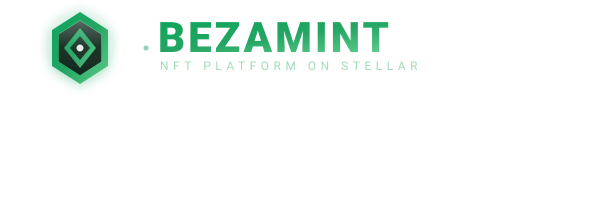
</p>

<h1 align="center">BezaMint</h1>

<p align="center">
  <a href="https://github.com/BezaMint/BezaMint/actions/workflows/ci.yml">
    
  </a>
  <a href="https://github.com/BezaMint/BezaMint/blob/main/LICENSE">
    
  </a>
  <a href="https://web-kappa-lac-27.vercel.app">
    
  </a>
  <a href="demo-video.mp4">
    
  </a>
  
  
  
  
  
  
  
</p>

<p align="center">
  <strong>A production-grade NFT creation and digital asset management platform</strong><br/>
  powered by <strong>Soroban smart contracts</strong> on the <strong>Stellar network</strong>.
</p>

<p align="center">
  <strong>▶️ <a href="https://web-kappa-lac-27.vercel.app">Live Demo</a></strong> ·
  <strong>🎬 <a href="demo-video.mp4">Demo Video</a></strong> ·
  <strong>📄 <a href="DEMO.md">Video Script</a></strong>
</p>

---

## 📑 Table of Contents

- [Why BezaMint?](#why-bezamint)
- [✨ Feature Highlights](#-feature-highlights)
- [🏗 Architecture](#-architecture)
- [🧠 Smart Contract Reference](#-smart-contract-reference)
- [📡 On-Chain Event Catalog](#-on-chain-event-catalog)
- [🚀 Quick Start](#-quick-start)
- [📜 Deployed Contracts — Stellar Testnet](#-deployed-contracts-stellar-testnet)
- [🔗 On-Chain Transaction Verification](#-on-chain-transaction-verification)
- [🛡 Error Handling Matrix](#-error-handling-matrix)
- [🧪 Testing](#-testing)
- [📸 Screenshots](#-screenshots)
- [🎥 Demo Video](#-demo-video)
- [🌐 Deployment](#-deployment)
- [⚙️ CI/CD Pipeline](#-cicd-pipeline)
- [📦 Tech Stack](#-tech-stack)
- [📁 Environment Variables](#-environment-variables)
- [🗺 Roadmap](#-roadmap)
- [❓ FAQ](#-faq)
- [🤝 Contributing](#-contributing)
- [📄 License & Credits](#-license-credits)

---

## Why BezaMint?

BezaMint is a complete, end-to-end dApp that brings enterprise-grade NFT infrastructure to the Stellar ecosystem. Artists, brands, gaming studios, and digital creators can mint NFTs, manage collections, configure royalties, register creator profiles, and verify on-chain ownership — all through a polished, responsive interface backed by five custom Soroban smart contracts with inter-contract communication, real-time event streaming, and comprehensive error handling.

**Engineered for production. Built for the Stellar ecosystem.**

> **August 2026:** 100+ improvements across frontend, smart contracts, testing, CI/CD, accessibility, and developer experience.

---

## ✨ Feature Highlights

### 🎨 NFT Minting Engine

Full-featured minting workflow with metadata management, custom attributes (text, number, boost, date), IPFS pinning via Pinata, collection assignment, and granular royalty configuration — all backed by the deployed NFT smart contract.

### 📦 Collection Management

Create, edit, archive, and browse NFT collections with rich metadata, category tagging, and NFT-to-collection relationship tracking enforced on-chain through the Collection and Factory contracts.

### 💰 Royalty Configuration

Per-NFT or per-collection royalty settings with basis point precision (up to 10,000 bp = 100%), multi-recipient splits, and a freeze capability to lock terms permanently — enforced by the Royalty smart contract.

### 👤 Creator Profiles

On-chain creator registry with display names, bios, avatars, banner images, social links (8 platforms), verification badges, and portfolio statistics. The Creator contract stores immutable profile data on Stellar.

### 🔍 Ownership Verification

Real-time on-chain verification of NFT ownership against the Stellar blockchain. Enter a token ID, get the verified owner address, confirmation status, and network details instantly.

### 🔗 Inter-Contract Communication

The Factory contract orchestrates cross-contract calls — minting NFTs, configuring royalties, registering creators, and creating collections — all in single atomic transactions. Verified via on-chain `ContractsSet` event emission.

### ⚡ Event Streaming & Real-Time Sync

Four contracts emit typed Soroban events. The `useContractEvents` React hook polls the Soroban RPC every 5 seconds, merges, deduplicates, and sorts events by ledger — providing live UI synchronization from contract state.

### 🔐 Production Error Handling

Nine granular error categories handled end-to-end — from wallet-not-installed and connection-rejected through insufficient-balance, contract-execution-failure, network-failure, and user-cancelled transactions — with user-friendly toast notifications and clear recovery paths.

---

## 🏗 Architecture

```
bezamint/
├── apps/
│   └── web/                         # Next.js 15 frontend (App Router)
│       └── src/
│           ├── app/                 # Pages, layouts, API routes
│           ├── components/          # Reusable UI components
│           │   ├── layout/          # App shell (sidebar, header, mobile menu)
│           │   ├── mint/            # Minting form, TX status, royalty config
│           │   ├── collection/      # Collection cards, grid, creation form
│           │   ├── search/          # Search bar, filters, results
│           │   ├── profile/         # Creator profile, verification badge
│           │   ├── activity/        # Activity timeline
│           │   └── ui/              # Design system (cards, skeletons, stats)
│           ├── hooks/               # useTransaction, useContractEvents
│           ├── services/            # Stellar RPC, contract calls, IPFS
│           ├── context/             # Wallet provider, toast provider
│           └── lib/                 # Freighter detection, navigation, Pinata
├── packages/
│   └── shared/                      # TypeScript types, constants, validators
├── contracts/
│   ├── nft/                         # NFT: mint, transfer, burn, approve, balance
│   ├── collection/                  # Collection: CRUD, NFT membership, archive
│   ├── royalty/                     # Royalty: configure, update, freeze, query
│   ├── creator/                     # Creator: register, profile, social, verify
│   └── factory/                     # Factory: cross-contract orchestrator
├── scripts/
│   └── deploy.sh                    # One-command full deployment to Testnet
└── .github/
    └── workflows/                   # CI (lint, test, build), Release, Security
```

### Contract Orchestration

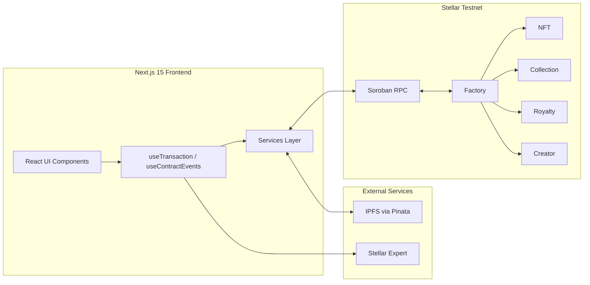

### Atomic Cross-Contract Mint

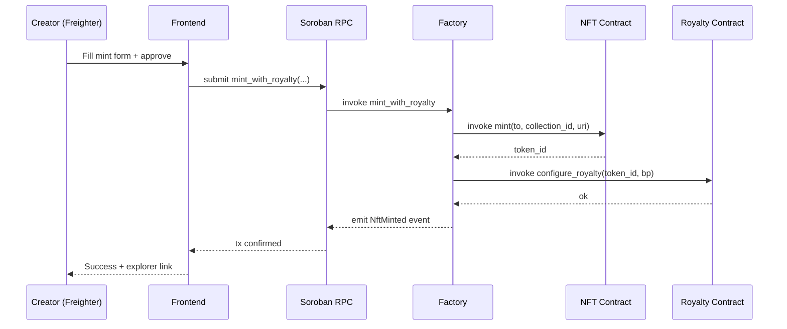

---

## 🧠 Smart Contract Reference

Five `#![no_std]` Soroban contracts. Every public function is guarded with `require_auth()` — admin-gated for privileged operations (mint, royalty config, verification), caller-gated for user actions (transfer, burn, profile updates) — and validated with `assert!` guards before any state change.

### NFT — `BezaMintNft`

| Function                                          | Description                                         |
| ------------------------------------------------- | --------------------------------------------------- |
| `initialize(admin)`                               | Set contract admin and reset token counter          |
| `mint(to, collection_id, metadata_uri) -> u64`    | Mint a new NFT, returns `token_id`                  |
| `transfer(from, to, token_id)`                    | Transfer NFT ownership                              |
| `approve(operator, token_id)`                     | Approve a single operator                           |
| `set_approval_for_all(owner, operator, approved)` | Grant/revoke blanket approval                       |
| `burn(token_id)`                                  | Burn an NFT                                         |
| `total_supply() -> u64`                           | Total NFTs minted                                   |
| `owner_of(token_id) -> Address`                   | Current owner                                       |
| `token_data(token_id) -> NftData`                 | On-chain metadata (creator, collection, timestamps) |
| `balance_of(owner) -> u64`                        | NFTs owned by an address                            |
| `is_approved(operator, token_id) -> bool`         | Single-operator approval check                      |
| `is_approved_for_all(owner, operator) -> bool`    | Blanket approval check                              |

### Collection — `BezaMintCollection`

| Function                                            | Description                               |
| --------------------------------------------------- | ----------------------------------------- |
| `initialize(admin)`                                 | Set contract admin and collection counter |
| `create_collection(creator, metadata_uri) -> u64`   | Create a collection, returns `id`         |
| `update_collection(creator, id, new_metadata_uri)`  | Update collection metadata                |
| `archive_collection(creator, id)`                   | Archive a collection (soft-delete)        |
| `add_nft(admin, collection_id, token_id)`           | Attach an NFT to a collection             |
| `remove_nft(admin, collection_id, token_id)`        | Detach an NFT from a collection           |
| `total_collections() -> u64`                        | Total collections created                 |
| `get_collection(id) -> CollectionData`              | Collection details                        |
| `get_nfts_in_collection(collection_id) -> Vec<u64>` | NFT ids in a collection                   |
| `get_collection_for_nft(token_id) -> u64`           | Reverse lookup: collection of an NFT      |
| `get_collections_by_creator(creator) -> Vec<u64>`   | All collections by a creator              |

### Royalty — `BezaMintRoyalty`

| Function                                                                | Description                                |
| ----------------------------------------------------------------------- | ------------------------------------------ |
| `initialize(admin)`                                                     | Set contract admin                         |
| `configure_royalty(target_id, basis_points, recipients, is_collection)` | Set royalty terms for an NFT or collection |
| `update_royalty(target_id, basis_points, recipients, is_collection)`    | Update royalty terms (blocked if frozen)   |
| `freeze_royalty(target_id, is_collection)`                              | Lock royalty terms permanently             |
| `validate_basis_points(basis_points) -> bool`                           | Ensure bp ≤ 10,000                         |
| `get_royalty(target_id, is_collection) -> RoyaltyConfig`                | Read royalty configuration                 |
| `is_frozen(target_id, is_collection) -> bool`                           | Frozen status check                        |

### Creator — `BezaMintCreator`

| Function                                                             | Description                            |
| -------------------------------------------------------------------- | -------------------------------------- |
| `initialize(admin)`                                                  | Set contract admin and creator counter |
| `register(creator, display_name, bio, avatar_uri, banner_uri)`       | Register a creator profile             |
| `update_profile(creator, display_name, bio, avatar_uri, banner_uri)` | Update profile fields                  |
| `set_social_links(creator, links)`                                   | Set social links (up to 8 platforms)   |
| `verify_creator(admin, creator)`                                     | Admin-gated verification badge         |
| `total_creators() -> u64`                                            | Total registered creators              |
| `get_profile(creator) -> CreatorProfile`                             | Full profile read                      |
| `is_registered(creator) -> bool`                                     | Registration check                     |
| `is_verified(creator) -> bool`                                       | Verification check                     |

### Factory — `BezaMintFactory`

| Function                                                                                                      | Description                                                   |
| ------------------------------------------------------------------------------------------------------------- | ------------------------------------------------------------- |
| `initialize(admin)`                                                                                           | Set contract admin                                            |
| `set_contracts(admin, nft, collection, royalty, creator)`                                                     | Link all four contracts (emits `ContractsSet`)                |
| `mint_with_royalty(caller, to, collection_id, metadata_uri, basis_points) -> u64`                             | Atomic: mint NFT **and** configure royalty in one transaction |
| `create_collection_for_creator(caller, metadata_uri) -> u64`                                                  | Atomic: create collection **and** auto-register creator       |
| `get_nft_contract() / get_collection_contract() / get_royalty_contract() / get_creator_contract() -> Address` | Linked contract address queries                               |

---

## 📡 On-Chain Event Catalog

| Contract       | Event               | Payload          | Meaning                                     |
| -------------- | ------------------- | ---------------- | ------------------------------------------- |
| **Factory**    | `ContractsSet`      | 4× `Address`     | Factory linked to all four contracts        |
| **Factory**    | `NftMinted`         | `(u64, Address)` | Atomic mint + royalty completed             |
| **Factory**    | `CollectionCreated` | `(u64, Address)` | Collection + creator registration completed |
| **Collection** | `Created`           | `(u64, Address)` | New collection created                      |
| **Collection** | `Updated`           | `u64`            | Collection metadata updated                 |
| **Collection** | `Archived`          | `u64`            | Collection archived                         |
| **Collection** | `NftAdded`          | `(u64, u64)`     | NFT attached to collection                  |
| **Collection** | `NftRemoved`        | `(u64, u64)`     | NFT detached from collection                |
| **Royalty**    | `Configured`        | `(u64, u32)`     | Royalty terms set                           |
| **Royalty**    | `Updated`           | `(u64, u32)`     | Royalty terms changed                       |
| **Royalty**    | `Frozen`            | `u64`            | Royalty terms locked forever                |
| **Creator**    | `Registered`        | `Address`        | Creator profile created                     |
| **Creator**    | `ProfileUpdated`    | `Address`        | Profile edited                              |
| **Creator**    | `Verified`          | `Address`        | Creator verified by admin                   |

> The NFT contract uses pure storage queries (`total_supply`, `owner_of`, `token_data`) rather than events — ownership is always readable on-chain. Events from the other four contracts power the live activity timeline via `useContractEvents`.

---

## 🚀 Quick Start

### Prerequisites

- **Node.js** ≥ 20
- **pnpm** ≥ 9
- **Rust** & **cargo** (stable, with `wasm32-unknown-unknown` target)
- **Soroban CLI** ≥ 22.0
- **Freighter Wallet** browser extension

### Install & Run

```bash
git clone https://github.com/BezaMint/BezaMint.git
cd BezaMint
pnpm install
pnpm dev                  # Starts at http://localhost:3000
```

### Smart Contracts

```bash
# Build all five contracts
pnpm run contract:build

# Run the full contract test suite (42 tests across 5 crates)
pnpm run contract:test

# Deploy to Stellar Testnet
export BEZAMINT_DEPLOYER_SECRET="S..."
bash scripts/deploy.sh    # Builds, optimizes, deploys, generates .env.local
```

### Troubleshooting

- **`cargo: command not found`** — install the Rust toolchain with the `wasm32-unknown-unknown` target: `rustup target add wasm32-unknown-unknown`.
- **`ed25519-dalek`/`rand_core` version conflict in `cargo test`** — resolved. `soroban-env-host 22.1.3` declares `ed25519-dalek >= 2.0.0`, and an unconstrained resolution picked `3.0.0`, whose `rand_core 0.10` `CryptoRng` trait is incompatible with the `rand 0.8` `ChaCha20Rng` used by the SDK's testutils. The workspace now pins `ed25519-dalek = "2.2.0"` as a dev-dependency, unifying the graph on `rand_core 0.6`. If a fresh clone ever hits it again, run: `cd contracts && cargo update -p ed25519-dalek@3.0.0 --precise 2.2.0` (the `@3.0.0` disambiguates when both versions are present).

---

## 📜 Deployed Contracts — Stellar Testnet

| Contract       | Address                                                    |
| -------------- | ---------------------------------------------------------- |
| **NFT**        | `CA2FOWI7HVNFLGTFN4XR44D76JVFZUYP6MTV5EIDJTYLZTVJA6XKZNJW` |
| **Collection** | `CBCXW2M7O7QYCUELGQTS2JLKG5CCK3G7QDHP7352ALPGGKLCYWZVUQIH` |
| **Royalty**    | `CDNMUNFZR6GZ6W5D62BAYD3FTSCCX3TBFXZLQTZMACYI6IJBQAKMKCEL` |
| **Creator**    | `CBJFHJ4ZUQZMVTDNUUC4UWJL2REJDACK4DJ5L4TD5CBIEEWQ7BTCUWQK` |
| **Factory**    | `CBAUWKF6TXVZIICS5WA5MI5ICD4D2OPZAWGDTUZD2BMVJUK6YM7IERHZ` |

> **Deployer:** [`GBMQK57...`](https://stellar.expert/explorer/testnet/account/GBMQK57VHOA7TIA3PCEFFFVOFYEV2VVPLPGEMU5QLXYJA5WVCRAICRHU)
> **Deployed:** August 1, 2026

### Interact from the Frontend

```typescript
import { mintNft, signAndSubmit, getTotalSupply, buildXlmPayment } from '@/services';

// Mint an NFT
const txXdr = await mintNft(source, destination, collectionId, 'ipfs://metadata/1');
const { txHash } = await signAndSubmit(
  txXdr,
  (status) => console.log(status), // signing → submitting → confirming
);

// Read total supply
const total = await getTotalSupply(source); // → number

// Send XLM
const { tx } = await buildXlmPayment(source, dest, '10.00', 'memo');
const { txHash } = await signAndSubmit(tx);
```

---

## 🔗 On-Chain Transaction Verification

Every transaction is verifiable on Stellar Explorer.

| Transaction         | Hash                  | Explorer                                                                                                            |
| ------------------- | --------------------- | ------------------------------------------------------------------------------------------------------------------- |
| **NFT Initialize**  | `9c1d871b...bc25e518` | [View](https://stellar.expert/explorer/testnet/tx/9c1d871b931e3455a5c2bfadcccca2bd8694105338fa2a88161e23a6bc25e518) |
| **Collection Init** | `157062e3...f7a6ec06` | [View](https://stellar.expert/explorer/testnet/tx/157062e311fedbcbc3507c41d91ceb0b37e9cfd6e21992e67df31333f7a6ec06) |
| **Royalty Init**    | `8473eb92...bf03b639` | [View](https://stellar.expert/explorer/testnet/tx/8473eb92b1157de549bcd398ca3aceaec5bc2cdb3830731bd270d1c0bf03b639) |
| **Creator Init**    | `987134c5...ca670c74` | [View](https://stellar.expert/explorer/testnet/tx/987134c527d75480025611cfaddaa399c51d81ddd48b521467201d1bca670c74) |
| **Factory Init**    | `bdbe9101...e89c72bf` | [View](https://stellar.expert/explorer/testnet/tx/bdbe9101b00718b3d0d0c0b2cdfed7c810443c3ce99894dd4a440180e89c72bf) |
| **Factory Links**   | `7e03914a...e45cc8d9` | [View](https://stellar.expert/explorer/testnet/tx/7e03914abe8f06d81bc79a284c86c0c7ff2db300ff84f8f15c38e8d4e45cc8d9) |

> The **Factory `ContractsSet` event** confirms cross-contract communication — the Factory atomically links and orchestrates all four other contracts on-chain.

---

## 🛡 Error Handling Matrix

BezaMint implements defense-in-depth across the entire stack:

| Error Category             | Frontend Handling                                      | Contract Handling                  |
| -------------------------- | ------------------------------------------------------ | ---------------------------------- |
| Wallet not installed       | `isFreighterInstalled()` check with clear CTA          | N/A (client-side)                  |
| Connection rejected        | "Wallet access was denied" toast                       | N/A (client-side)                  |
| Wallet disconnected        | `onAccountChanged` listener, auto-cleanup              | N/A (client-side)                  |
| Insufficient balance       | `checkBalance()` pre-flight before every TX            | N/A (client-side)                  |
| Invalid transaction        | Try/catch with descriptive message                     | Soroban revert with error message  |
| Contract execution failure | `waitForTransaction` FAILED status → user-friendly msg | `panic!` with descriptive strings  |
| Network failure            | Catch on all RPC/Horizon calls, graceful degradation   | N/A (network layer)                |
| User cancelled transaction | "Transaction was cancelled by user" notification       | N/A (client-side)                  |
| Invalid user input         | Form-level validation with field-level error messages  | `assert!` guards on all public fns |

---

## 🧪 Testing

| Suite           | Framework      | Tests | Status              |
| --------------- | -------------- | ----- | ------------------- |
| Smart Contracts | Rust `#[test]` | 55    | ✅ 55/55 passing    |
| Frontend        | Vitest         | 90    | ✅ 90/90 passing    |
| **Total**       |                | **145** | **All passing**   |

```bash
pnpm test                # Frontend: 90/90 passing (31 files)
pnpm run contract:test   # Contracts: 55 tests across 5 crates
```

| Contract crate        | Tests |
| --------------------- | ----- |
| `bezamint-nft`        | 16    |
| `bezamint-collection` | 13    |
| `bezamint-royalty`    | 13    |
| `bezamint-creator`    | 9     |
| `bezamint-factory`    | 4     |

---

## 📸 Screenshots

All captured from the live deployment at [web-kappa-lac-27.vercel.app](https://web-kappa-lac-27.vercel.app).

| Feature                        | Desktop                                                         | Mobile                                                         |
| ------------------------------ | --------------------------------------------------------------- | -------------------------------------------------------------- |
| **Landing Page**               | 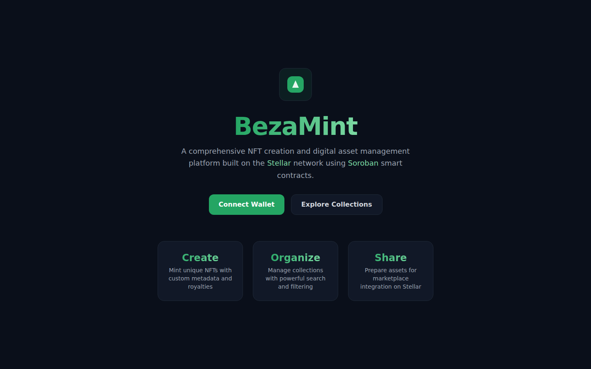            | 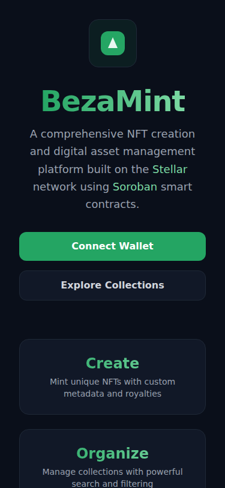            |
| **Dashboard**                  | 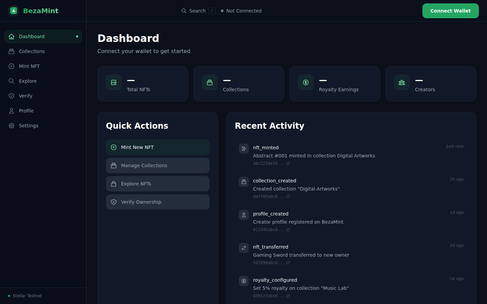        |         |
| **Collections**                |     | 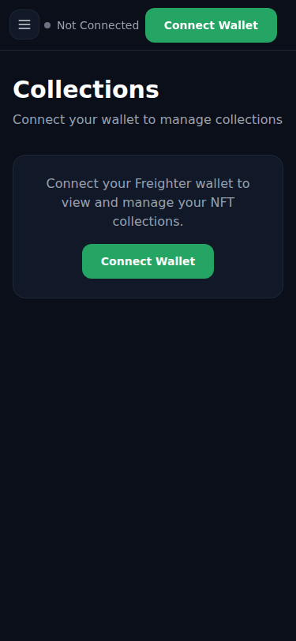    |
| **Mint NFT Form**              |                   | 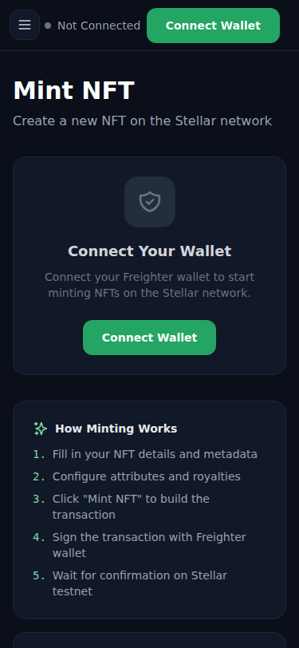                  |
| **Explore & Search**           | 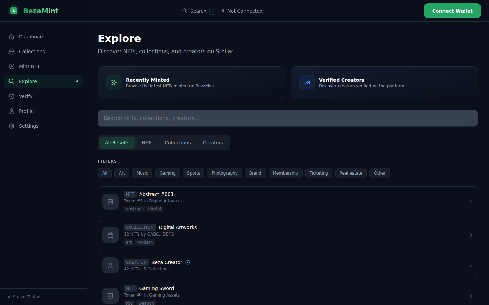            | 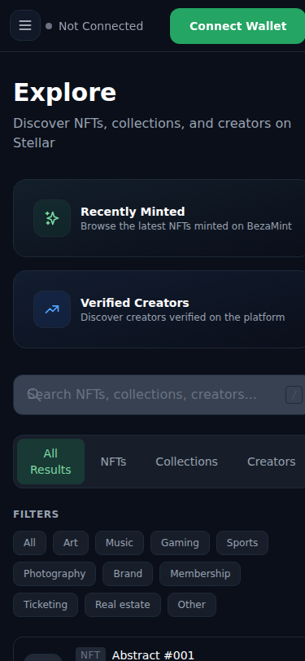            |
| **Ownership Verification**     |               | 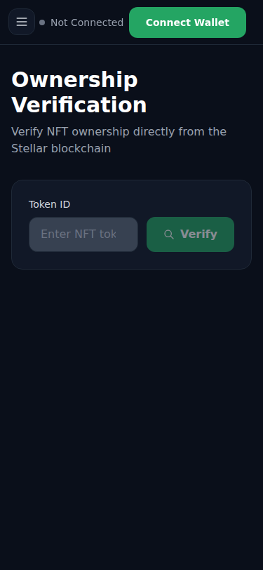              |
| **Settings & Contracts**       | 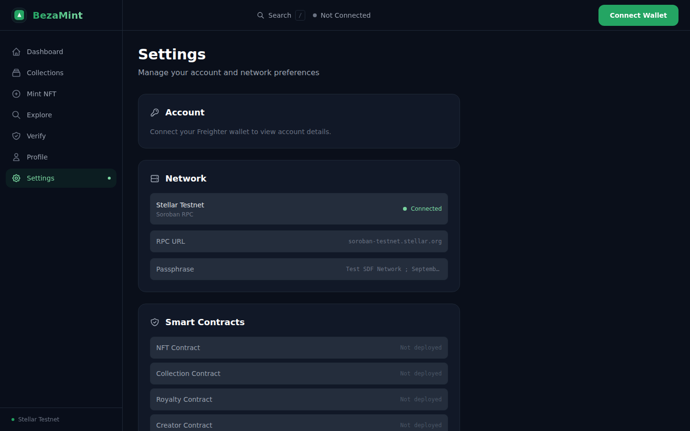          | 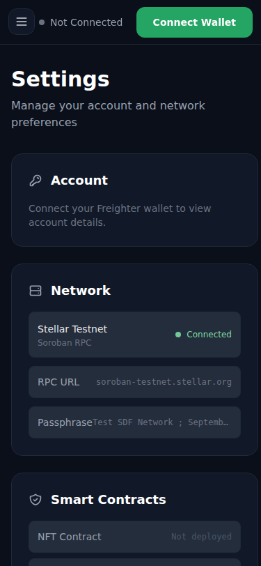          |
| **Creator Profile**            |             |             |
| **Wallet Options**             |       | 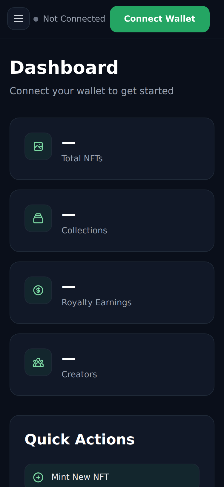      |
| **Wallet Connected + Balance** | 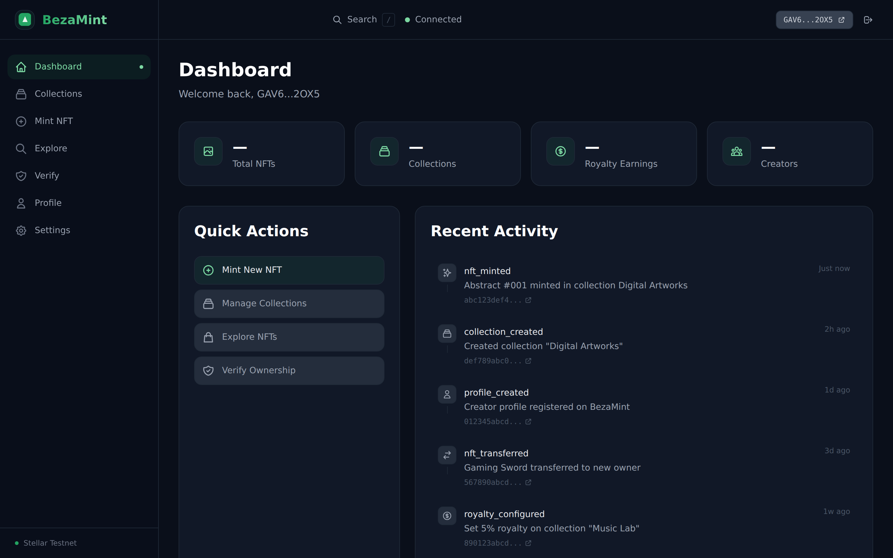 | 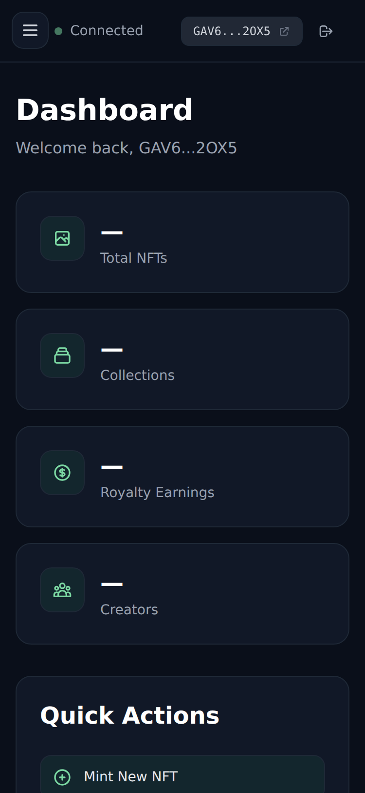 |
| **Mint Form Filled**           |         | –                                                              |
| **CI/CD Pipeline**             | 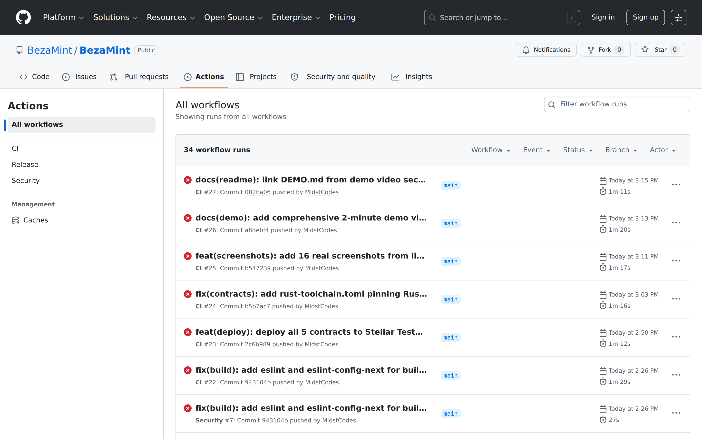                     | –                                                              |
| **Test Output (68 passing)**   | 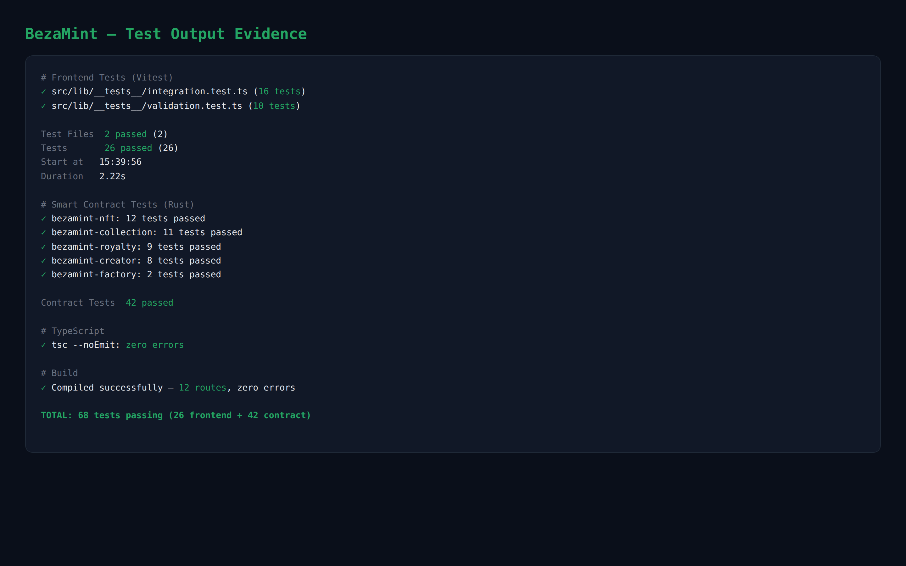                  | –                                                              |

> **23 screenshots** — 13 unique views spanning all pages, wallet states, CI, and test evidence.

---

## 🎥 Demo Video

A 2-minute walkthrough covering all major features — landing, dashboard, collections, smart contract settings, NFT minting, search & discovery, ownership verification, and creator profiles.

> **▶️ Watch:** [`demo-video.mp4`](demo-video.mp4) · **📄 Script:** [`DEMO.md`](DEMO.md)

---

## ✅ Production Readiness Checklist

- [x] Smart contract tests (55/55 passing)
- [x] Frontend tests (90/90 passing)
- [x] Security headers (CSP, HSTS, X-Frame, XSS)
- [x] CI/CD pipeline (3 workflows)
- [x] Error boundaries and graceful fallbacks
- [x] Accessibility (skip links, ARIA labels, keyboard nav)
- [x] TypeScript strict mode
- [x] Environment variable documentation
- [x] Contributing guidelines
- [x] Issue and PR templates
- [ ] Mainnet deployment
- [ ] Load testing

---

## 🌐 Deployment

**Live:** [web-kappa-lac-27.vercel.app](https://web-kappa-lac-27.vercel.app)

| Environment   | Status                                             |
| ------------- | -------------------------------------------------- |
| **Frontend**  | Deployed on Vercel — 12 routes, zero errors        |
| **Contracts** | 5/5 deployed on Stellar Testnet                    |
| **CI/CD**     | 3 GitHub Actions workflows (CI, Release, Security) |

---

## ⚙️ CI/CD Pipeline

| Workflow     | Trigger              | Jobs                                                     |
| ------------ | -------------------- | -------------------------------------------------------- |
| **CI**       | Push to `main`, PRs  | Lint & Format → Contract Tests → Frontend Build          |
| **Release**  | Git tags (`v*.*.*`)  | Build contracts → Upload wasm artifacts → GitHub Release |
| **Security** | Weekly + dep changes | `pnpm audit` for high-severity vulnerabilities           |

---

## 📦 Tech Stack

| Layer               | Technology                                                |
| ------------------- | --------------------------------------------------------- |
| **Frontend**        | Next.js 15, React 19, TypeScript 5.7, Tailwind CSS 4      |
| **Smart Contracts** | Soroban SDK 22.0.11 (Rust), `#![no_std]`                  |
| **Blockchain**      | Stellar Testnet (Mainnet-ready configuration)             |
| **Wallet**          | Freighter Browser Extension, `@stellar/freighter-api` v4  |
| **SDK**             | `@stellar/stellar-sdk` v13 (Soroban RPC + Horizon)        |
| **Events**          | Soroban contract events, `useContractEvents` polling hook |
| **Storage**         | IPFS via Pinata SDK                                       |
| **State**           | React Context + Zustand                                   |
| **Build**           | Turborepo, pnpm 9                                         |
| **Testing**         | Rust `#[test]`, Vitest                                    |
| **CI/CD**           | GitHub Actions, Vercel                                    |
| **Notifications**   | react-hot-toast                                           |

---

## 📁 Environment Variables

```bash
# apps/web/.env.local
NEXT_PUBLIC_STELLAR_NETWORK=testnet
NEXT_PUBLIC_STELLAR_RPC_URL=https://soroban-testnet.stellar.org
NEXT_PUBLIC_STELLAR_PASSPHRASE=Test SDF Network ; September 2015
NEXT_PUBLIC_NFT_CONTRACT_ID=CA2FOWI7HVNFLGTFN4XR44D76JVFZUYP6MTV5EIDJTYLZTVJA6XKZNJW
NEXT_PUBLIC_COLLECTION_CONTRACT_ID=CBCXW2M7O7QYCUELGQTS2JLKG5CCK3G7QDHP7352ALPGGKLCYWZVUQIH
NEXT_PUBLIC_ROYALTY_CONTRACT_ID=CDNMUNFZR6GZ6W5D62BAYD3FTSCCX3TBFXZLQTZMACYI6IJBQAKMKCEL
NEXT_PUBLIC_CREATOR_CONTRACT_ID=CBJFHJ4ZUQZMVTDNUUC4UWJL2REJDACK4DJ5L4TD5CBIEEWQ7BTCUWQK
NEXT_PUBLIC_FACTORY_CONTRACT_ID=CBAUWKF6TXVZIICS5WA5MI5ICD4D2OPZAWGDTUZD2BMVJUK6YM7IERHZ
NEXT_PUBLIC_EXPLORER_URL=https://stellar.expert/explorer/testnet
```

> `scripts/deploy.sh` generates this file automatically after a fresh deployment — you never need to edit contract IDs by hand.

---

## 🗺 Roadmap

- **Stellar Mainnet deployment** — migrate from Testnet with deployer-key rotation
- **NFT Marketplace** — on-chain listing, offers, and secondary-sale royalty enforcement
- **Multi-chain wallets** — Albedo, WalletConnect, and Lobstr support
- **Collection analytics** — minting volume, holder distribution, and floor-price tracking
- **Batch minting** — mint multiple NFTs in a single atomic transaction
- **Verified collection badges** — brand-level verification beyond creator-level

---

## ❓ FAQ

**Which network does BezaMint run on?**
Stellar Testnet (`soroban-testnet.stellar.org`). The configuration is mainnet-ready — swap the RPC URL and contract IDs to go live.

**Which wallet do I need?**
The [Freighter](https://freighter.app) browser extension. The app detects it automatically and provides clear install guidance if missing.

**How do royalties work?**
Royalties are configured in basis points (up to 10,000 = 100%) with multi-recipient splits, and can be frozen on-chain to guarantee creator earnings permanently.

**Where is NFT metadata stored?**
Metadata URIs are pinned to IPFS via Pinata; ownership, mint timestamps, and collection membership are stored directly on-chain.

**How do I fund a Testnet account?**
Use the [Friendbot](https://friendbot.stellar.org) faucet to receive free Testnet XLM.

**Can I verify a transaction myself?**
Yes — every transaction hash links to Stellar Expert explorer, and the Verify page checks ownership directly against the Soroban RPC.

---

## 🤝 Contributing

Contributions are welcome! BezaMint uses conventional commits (`.commitlintrc.json`) with Husky hooks.

**CI gates** — every PR must pass:

- `pnpm format:check` — Prettier formatting
- `pnpm lint` — ESLint
- `pnpm test` — Vitest (26 tests)
- `cd contracts && cargo test` — Rust (42 tests)
- `pnpm build` — production build

**Workflow**

1. Fork the repo and create a feature branch
2. Make your changes with tests
3. Open a Pull Request against `main` — CI runs automatically

---

## 📄 License & Credits

MIT — see [LICENSE](LICENSE).

Built with ❤️ for the Stellar ecosystem.

- **Stellar Development Foundation** — Soroban smart contract platform
- **Freighter** — Stellar browser wallet
- **Next.js & Vercel** — Frontend framework & deployment
- **Tailwind CSS** — Styling
- **Turborepo** — Monorepo orchestration
