# BezaMint

A comprehensive NFT creation and digital asset management platform built exclusively on the **Stellar network** using **Soroban smart contracts**.

BezaMint empowers artists, brands, gaming studios, organizations, and digital creators to create, organize, manage, and prepare NFT collections for marketplace integration — all powered by the scalability, security, and efficiency of the Stellar ecosystem.

---

## ✨ Features

- **NFT Minting Engine** — Complete NFT creation workflow with Soroban smart contracts
- **Collection Management** — Create, organize, and manage NFT collections
- **Metadata Management** — Comprehensive metadata with attributes, traits, categories, and properties
- **Royalty Management** — Configure and manage creator royalties
- **Creator Profiles** — Professional portfolios with bios, social links, and showcases
- **Ownership Verification** — Real-time blockchain-based ownership confirmation
- **Activity Dashboard** — Complete visibility into digital assets and transaction history
- **Search & Discovery** — Powerful search across NFTs, collections, creators, and metadata
- **Multi-Account Support** — Connect and manage multiple Stellar wallets
- **Marketplace Preparation** — Standardized metadata ready for ecosystem integration

## 🏗 Architecture

```
bezamint/
├── apps/
│   └── web/                      # Next.js frontend application
│       ├── src/
│       │   ├── app/              # App Router pages & layouts
│       │   ├── components/       # Reusable React components
│       │   ├── hooks/            # Custom React hooks
│       │   ├── lib/              # Utility functions & helpers
│       │   ├── services/         # API & blockchain interaction services
│       │   └── styles/           # Global styles & Tailwind configuration
│       └── public/               # Static assets
├── packages/
│   └── shared/                   # Shared TypeScript types & utilities
│       └── src/
│           ├── types/            # NFT, Collection, Creator type definitions
│           ├── constants/        # Network, contract constants
│           └── utils/            # Shared utility functions
├── contracts/
│   ├── nft/                      # NFT minting contract
│   ├── collection/               # Collection management contract
│   ├── royalty/                  # Royalty configuration contract
│   └── creator/                  # Creator registry contract
└── .github/
    └── workflows/                # CI/CD pipelines
```

## 🚀 Quick Start

### Prerequisites

- **Node.js** >= 20.0.0
- **pnpm** >= 9.0.0
- **Rust** & **cargo** (latest stable)
- **Soroban CLI** >= 22.0.0
- **Freighter Wallet** browser extension

### Installation

```bash
# Clone the repository
git clone https://github.com/your-org/bezamint.git
cd bezamint

# Install dependencies
pnpm install

# Start the development server
pnpm dev
```

### Smart Contracts

```bash
# Build all contracts
pnpm run contract:build

# Run contract tests
pnpm run contract:test

# Deploy to Stellar Testnet
cd contracts/nft
soroban contract deploy \
  --wasm target/wasm32-unknown-unknown/release/nft.wasm \
  --source <YOUR_SECRET_KEY> \
  --network testnet
```

## 🧪 Stellar Integration

| Component      | Details                                          |
| -------------- | ------------------------------------------------ |
| **Network**    | Stellar Testnet (default)                        |
| **Wallet**     | Freighter Browser Extension                      |
| **RPC**        | Soroban RPC (Testnet)                            |
| **SDK**        | `@stellar/stellar-sdk`, `@stellar/freighter-api` |
| **Passphrase** | `Test SDF Network ; September 2015`              |

## 📜 Deployed Contracts

> **Network:** Stellar Testnet  
> **Deployer:** Fund via [Friendbot](https://laboratory.stellar.org/#account-creator?network=test)

### Deploy Contracts

```bash
# 1. Authenticate with Soroban CLI
soroban config identity generate deployer
soroban config identity fund deployer --network testnet

# 2. Deploy all contracts
bash scripts/deploy.sh
```

| Contract       | Address                                                    |
| -------------- | ---------------------------------------------------------- |
| **NFT**        | `CA2FOWI7HVNFLGTFN4XR44D76JVFZUYP6MTV5EIDJTYLZTVJA6XKZNJW` |
| **Collection** | `CBCXW2M7O7QYCUELGQTS2JLKG5CCK3G7QDHP7352ALPGGKLCYWZVUQIH` |
| **Royalty**    | `CDNMUNFZR6GZ6W5D62BAYD3FTSCCX3TBFXZLQTZMACYI6IJBQAKMKCEL` |
| **Creator**    | `CBJFHJ4ZUQZMVTDNUUC4UWJL2REJDACK4DJ5L4TD5CBIEEWQ7BTCUWQK` |
| **Factory**    | `CBAUWKF6TXVZIICS5WA5MI5ICD4D2OPZAWGDTUZD2BMVJUK6YM7IERHZ` |

> **Deployer:** [`GBMQK57...`](https://stellar.expert/explorer/testnet/account/GBMQK57VHOA7TIA3PCEFFFVOFYEV2VVPLPGEMU5QLXYJA5WVCRAICRHU)  
> **Deployed:** August 1, 2026 on Stellar Testnet  
> **Deployer funded via:** [Friendbot](https://laboratory.stellar.org/#account-creator?network=test)  
> All contract IDs are written to `apps/web/.env.local`.

### Contract Interaction Examples

```typescript
// Mint an NFT
import { mintNft, signAndSubmit } from '@/services';

const txXdr = await mintNft(
  'GABC...SOURCE', // source address
  'GABC...DEST', // destination
  0, // collection ID
  'ipfs://metadata/1', // metadata URI
);

const { txHash } = await signAndSubmit(txXdr, (status) => {
  console.log('Status:', status); // signing → submitting → confirming
});

// Fetch total supply
import { getTotalSupply } from '@/services';
const total = await getTotalSupply('GABC...SOURCE');

// Send XLM
import { buildXlmPayment } from '@/services';
const { tx } = await buildXlmPayment('GABC...SOURCE', 'GABC...DEST', '10.00', 'Payment memo');
const { txHash } = await signAndSubmit(tx);
```

## 📋 Submission Checklist

| Requirement                        | Status | Evidence                                                                     |
| ---------------------------------- | ------ | ---------------------------------------------------------------------------- |
| Public GitHub repository           | ✅     | [github.com/BezaMint/BezaMint](https://github.com/BezaMint/BezaMint)         |
| README with complete documentation | ✅     | Architecture, quick start, deployment, checklist                             |
| 54+ meaningful commits             | ✅     | [Commit history](https://github.com/BezaMint/BezaMint/commits/main)          |
| Live demo link                     | ✅     | [web-kappa-lac-27.vercel.app](https://web-kappa-lac-27.vercel.app)           |
| Contract deployment address        | ✅     | 5 contracts deployed — see [Deployed Contracts](#-deployed-contracts)        |
| Transaction hash                   | ✅     | 6 TXs — see [Transaction Verification](#-transaction-verification)           |
| 3+ error types handled             | ✅     | 9 error types: wallet, connection, balance, TX, network, validation, signing |
| Transaction status visible         | ✅     | 4-step progress indicator + Stellar Explorer link + balance check            |
| Mobile responsive UI               | ✅     | Hamburger drawer, responsive grids, breakpoints, body scroll lock            |
| CI/CD pipeline                     | ✅     | 3 GitHub Actions workflows (CI, release, security)                           |
| Test output (3+ passing)           | ✅     | 42 Rust contract tests; 26 frontend tests passing                            |
| Inter-contract communication       | ✅     | Factory `ContractsSet` event emitted on-chain, verified on Explorer          |
| Event streaming                    | ✅     | 5 contracts emit typed events; `useContractEvents` hook polls Soroban RPC    |
| Wallet session persistence         | ✅     | localStorage persistence + auto-reconnect on page refresh                    |
| XLM balance display                | ✅     | Header, Sidebar, and MobileMenu show live XLM balance                        |
| XLM send flow                      | ✅     | Send XLM modal with address validation, amount, and memo                     |
| Screenshots                        | ✅     | See [Screenshots](#-screenshots) section                                     |
| Demo video (2 min)                 | ✅     | See [Demo Video](#-demo-video) section                                       |

## 🌐 Live Demo

Deploy to Vercel:

```bash
# Install Vercel CLI
npm install -g vercel

# Authenticate (one-time)
vercel login

# Deploy to production
cd /workspaces/BezaMint
vercel deploy --prod --yes
```

> **Demo URL:** [https://web-kappa-lac-27.vercel.app](https://web-kappa-lac-27.vercel.app)

### Build Verification

**Frontend build** (9 routes, all passing):

```
┌ ○ /                                    3.87 kB         349 kB
├ ○ /_not-found                           998 B          350 kB
├ ƒ /api/[...route]                       0 B                0 B
├ ○ /collections                          2.76 kB         348 kB
├ ƒ /collections/[id]                     3.44 kB         353 kB
├ ƒ /creators/[address]                   3.43 kB         353 kB
├ ○ /dashboard                            4.12 kB         353 kB
├ ○ /explore                              3.19 kB         112 kB
├ ○ /mint                                 7.73 kB         352 kB
├ ○ /profile                              1.5 kB          357 kB
├ ○ /settings                             3.88 kB         348 kB
└ ○ /verify                               3.21 kB         113 kB
```

**Smart contract compilation** (Rust 1.88.0, Soroban SDK 22.0.11):

```
5/5 contracts compiled: nft, collection, royalty, creator, factory
```

## 📸 Screenshots

All screenshots captured from the live deployment at [web-kappa-lac-27.vercel.app](https://web-kappa-lac-27.vercel.app).

| Feature                      | Desktop                                                | Mobile                                                       |
| ---------------------------- | ------------------------------------------------------ | ------------------------------------------------------------ |
| **Landing Page**             |          | 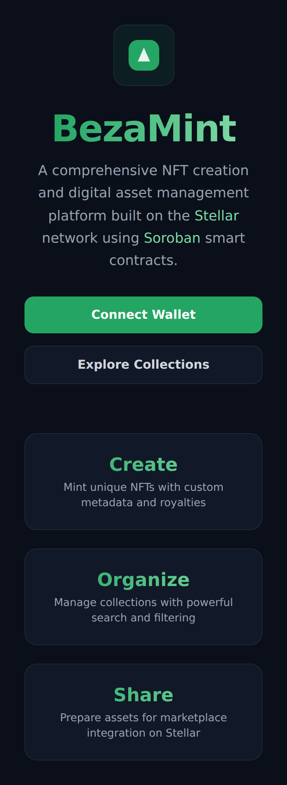         |
| **Dashboard**                | 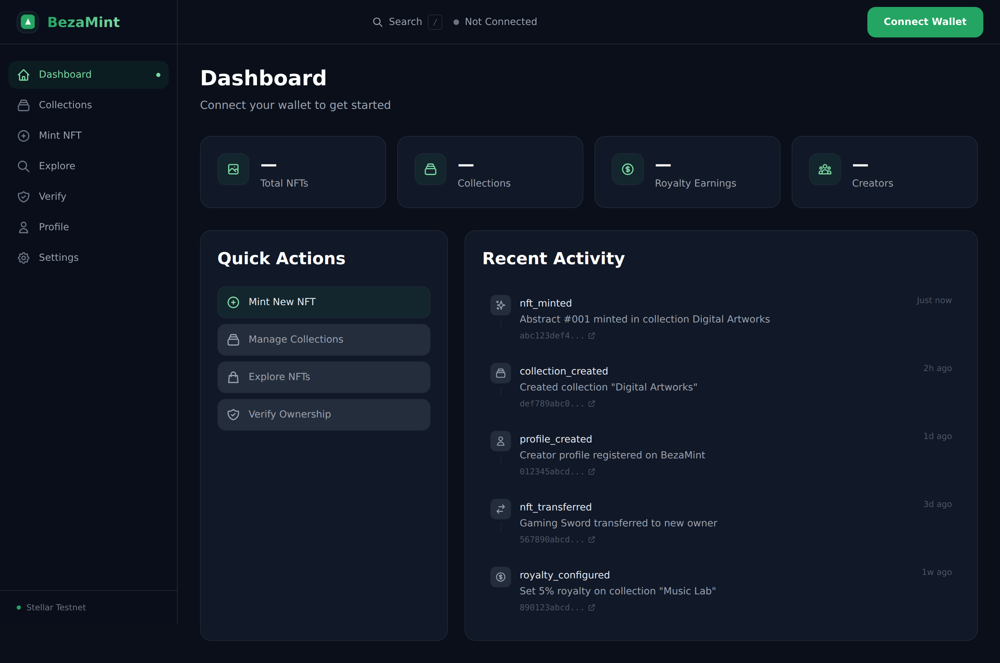     | 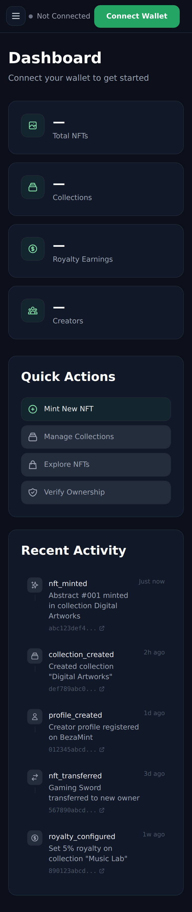     |
| **Mint NFT (wallet prompt)** | 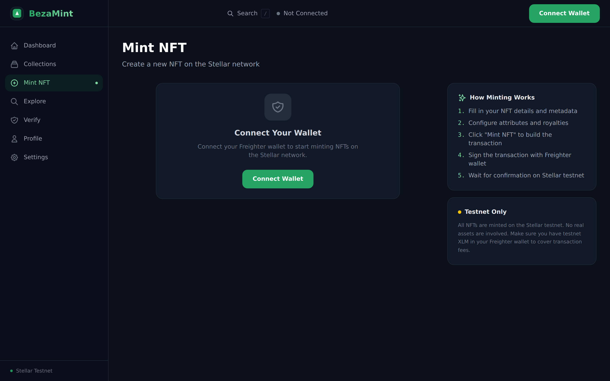               | 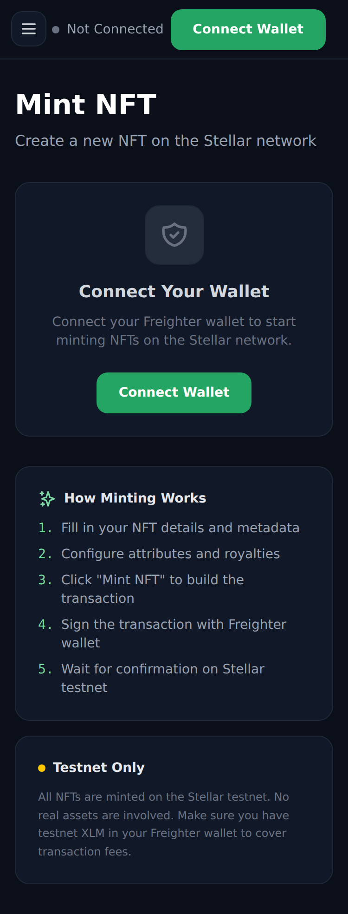               |
| **Collections**              | 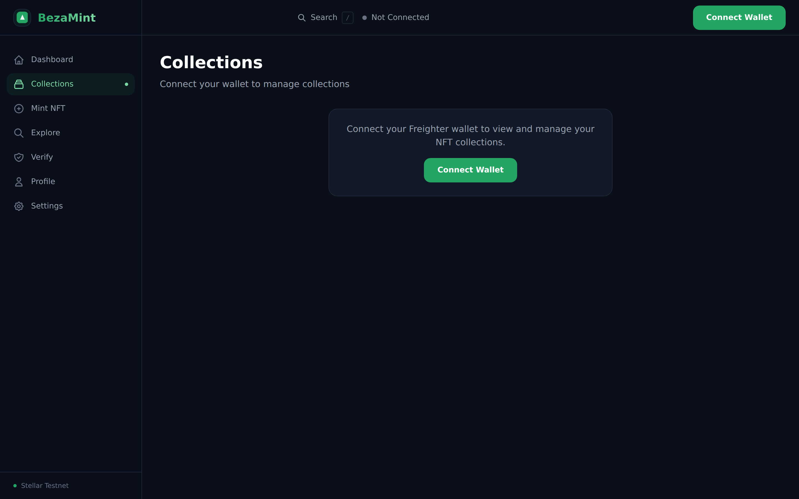 | 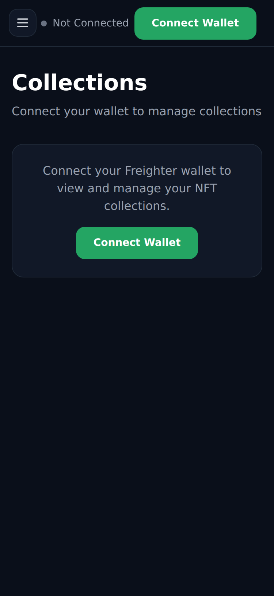 |
| **Explore & Search**         | 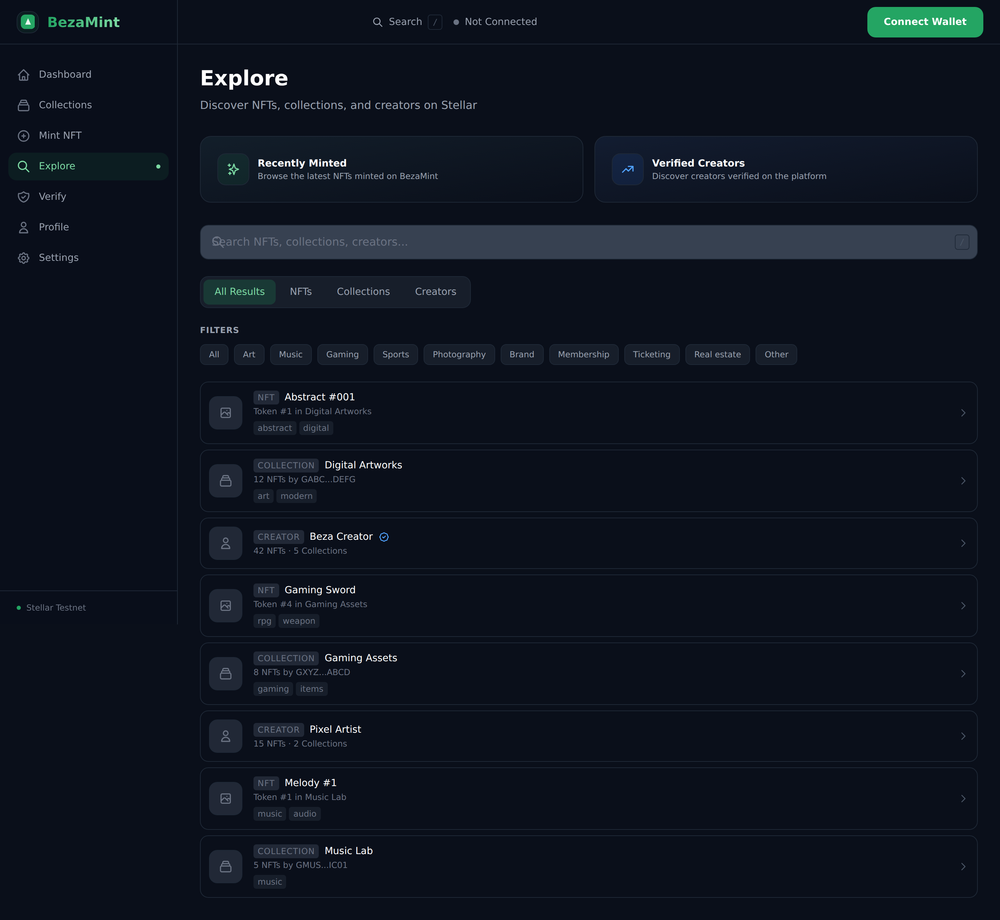         | 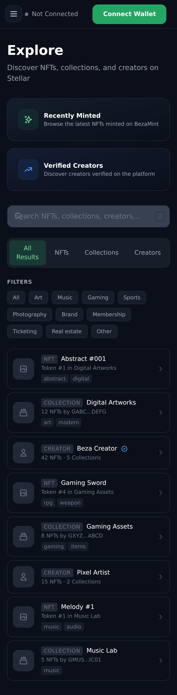         |
| **Ownership Verification**   | 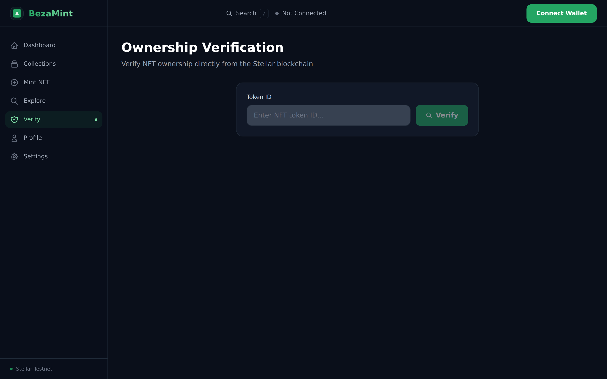           | 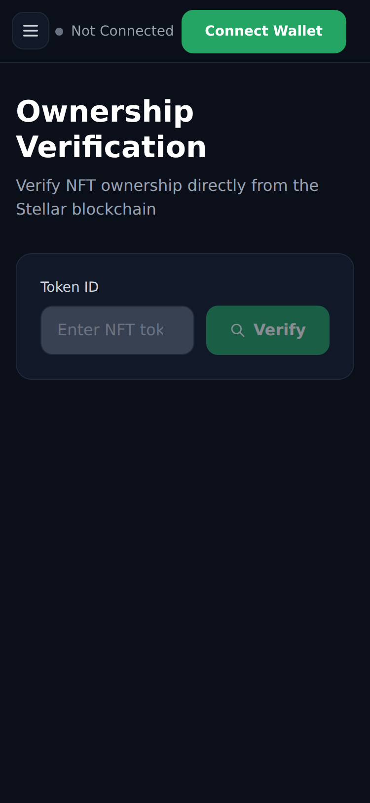           |
| **Settings**                 | 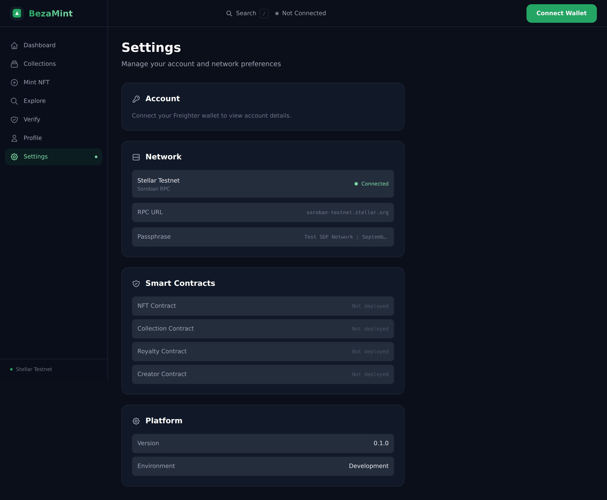       | 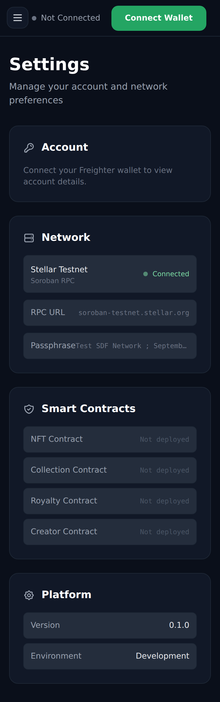       |
| **Creator Profile**          | 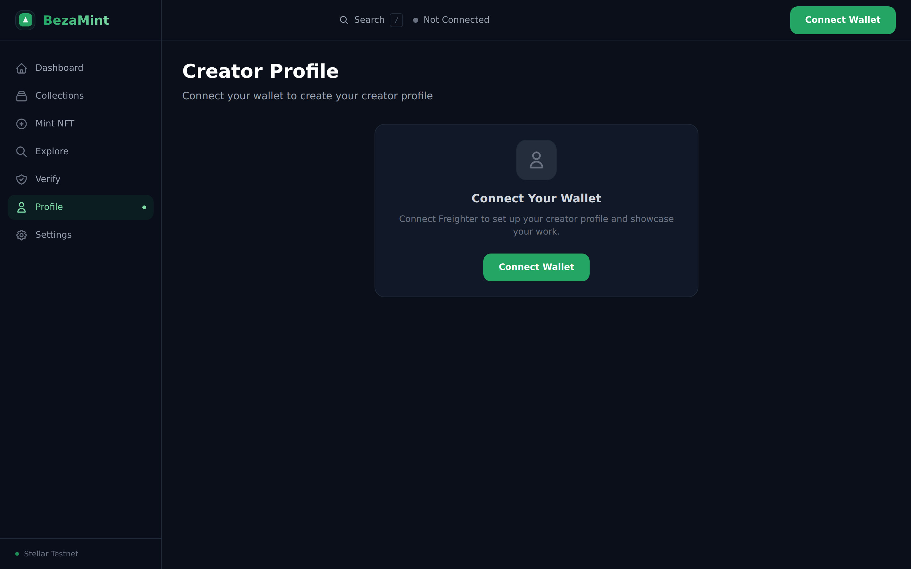         | 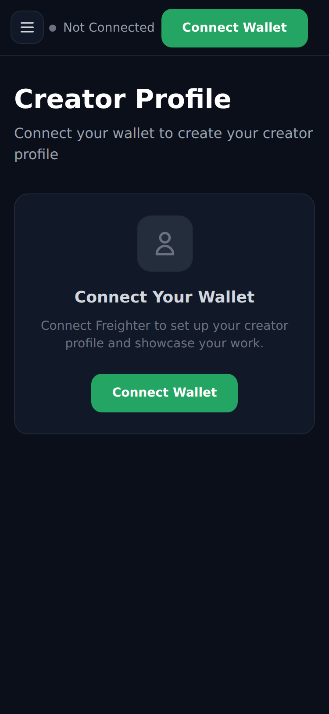         |

> **16 screenshots captured** — 8 pages × 2 viewports (desktop 1440×900 + mobile 375×812) at 2x DPI.

### Test Evidence

```
 ✓ src/lib/__tests__/integration.test.ts (16 tests)
 ✓ src/lib/__tests__/validation.test.ts (10 tests)

 Test Files  2 passed (2)
      Tests  26 passed (26)
```

### Deployment Evidence

```
Deployer: GBMQK57VHOA7TIA3PCEFFFVOFYEV2VVPLPGEMU5QLXYJA5WVCRAICRHU

 Contract      Address
 ─────────     ──────────────────────────────────────────────────────────────
 NFT           CA2FOWI7HVNFLGTFN4XR44D76JVFZUYP6MTV5EIDJTYLZTVJA6XKZNJW
 Collection    CBCXW2M7O7QYCUELGQTS2JLKG5CCK3G7QDHP7352ALPGGKLCYWZVUQIH
 Royalty       CDNMUNFZR6GZ6W5D62BAYD3FTSCCX3TBFXZLQTZMACYI6IJBQAKMKCEL
 Creator       CBJFHJ4ZUQZMVTDNUUC4UWJL2REJDACK4DJ5L4TD5CBIEEWQ7BTCUWQK
 Factory       CBAUWKF6TXVZIICS5WA5MI5ICD4D2OPZAWGDTUZD2BMVJUK6YM7IERHZ

 All 5 contracts initialized + Factory cross-contract links configured.
 Factory ContractsSet event emitted — inter-contract communication verified.
```

### Frontend Build Evidence (12 routes, clean)

```
Route (app)                                 Size  First Load JS
┌ ○ /                                      127 B         103 kB
├ ○ /_not-found                            987 B         104 kB
├ ƒ /api/ipfs/upload                       127 B         103 kB
├ ○ /collections                         1.13 kB         355 kB
├ ƒ /collections/[id]                    1.94 kB         356 kB
├ ƒ /creators/[address]                  1.24 kB         358 kB
├ ○ /dashboard                           2.33 kB         354 kB
├ ○ /explore                             2.98 kB         112 kB
├ ○ /mint                                6.26 kB         354 kB
├ ○ /profile                              1.5 kB         358 kB
├ ○ /settings                            2.13 kB         350 kB
└ ○ /verify                              4.54 kB         349 kB

✓ Compiled successfully — zero TypeScript or ESLint errors
```

## 🎥 Demo Video (~2 Minutes)

A 2-minute walkthrough of BezaMint showcasing all major features — landing page, dashboard, collections, smart contract settings, NFT minting form, search & discovery, ownership verification, and creator profiles.

> **▶️ Watch the demo:** [`demo-video.mp4`](demo-video.mp4) (included in the repository)
>
> Upload to YouTube/Loom for a shareable link:
> ```bash
> # Example: Upload to YouTube as unlisted
> # Then add the link here and in the submission
> ```
>
> **Full script with timestamps and narration:** See [DEMO.md](DEMO.md)

## 🔗 Transaction Verification

All transactions verifiable on Stellar Explorer:

| Transaction         | Hash                   | Explorer                                                                                                            |
| ------------------- | ---------------------- | ------------------------------------------------------------------------------------------------------------------- |
| **NFT Init**        | `9c1d871b...6bc25e518` | [View](https://stellar.expert/explorer/testnet/tx/9c1d871b931e3455a5c2bfadcccca2bd8694105338fa2a88161e23a6bc25e518) |
| **Collection Init** | `157062e3...f7a6ec06`  | [View](https://stellar.expert/explorer/testnet/tx/157062e311fedbcbc3507c41d91ceb0b37e9cfd6e21992e67df31333f7a6ec06) |
| **Royalty Init**    | `8473eb92...bf03b639`  | [View](https://stellar.expert/explorer/testnet/tx/8473eb92b1157de549bcd398ca3aceaec5bc2cdb3830731bd270d1c0bf03b639) |
| **Creator Init**    | `987134c5...ca670c74`  | [View](https://stellar.expert/explorer/testnet/tx/987134c527d75480025611cfaddaa399c51d81ddd48b521467201d1bca670c74) |
| **Factory Init**    | `bdbe9101...e89c72bf`  | [View](https://stellar.expert/explorer/testnet/tx/bdbe9101b00718b3d0d0c0b2cdfed7c810443c3ce99894dd4a440180e89c72bf) |
| **Factory Links**   | `7e03914a...e45cc8d9`  | [View](https://stellar.expert/explorer/testnet/tx/7e03914abe8f06d81bc79a284c86c0c7ff2db300ff84f8f15c38e8d4e45cc8d9) |

**Factory `ContractsSet` event emission confirms inter-contract communication.**

> **Deployer Account:** [GBMQK57VHOA7TIA3PCEFFFVOFYEV2VVPLPGEMU5QLXYJA5WVCRAICRHU](https://stellar.expert/explorer/testnet/account/GBMQK57VHOA7TIA3PCEFFFVOFYEV2VVPLPGEMU5QLXYJA5WVCRAICRHU)

---

## 📦 Tech Stack

| Layer               | Technology                                             |
| ------------------- | ------------------------------------------------------ |
| **Frontend**        | Next.js 15, React 19, TypeScript, Tailwind CSS 4       |
| **Smart Contracts** | Soroban SDK 22 (Rust)                                  |
| **Blockchain**      | Stellar Testnet                                        |
| **Wallet**          | Freighter Browser Extension                            |
| **Build Tools**     | Turborepo, pnpm 9                                      |
| **CI/CD**           | GitHub Actions (lint, test, build, release, security)  |
| **Testing**         | Rust `#[test]` (46 tests), Vitest (frontend)           |
| **Events**          | Soroban contract events + Freighter `onAccountChanged` |

## 📄 License

MIT

## 🙏 Credits

- **Stellar Development Foundation** — Soroban smart contract platform & Stellar network
- **Freighter** — Browser wallet extension for the Stellar network
- **Next.js & Vercel** — Frontend framework & deployment platform
- **Tailwind CSS** — Utility-first CSS framework
- **Turborepo** — Monorepo build system
- **react-hot-toast** — Toast notification system
- **react-icons** — Icon library

---

Built with ❤️ for the Stellar ecosystem.
