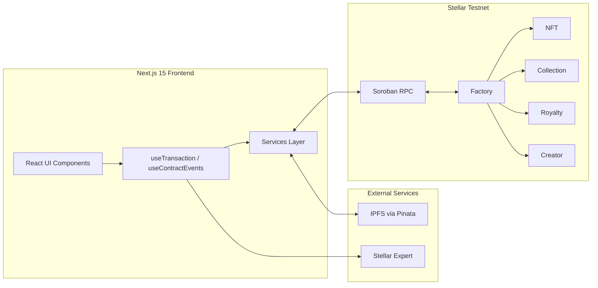
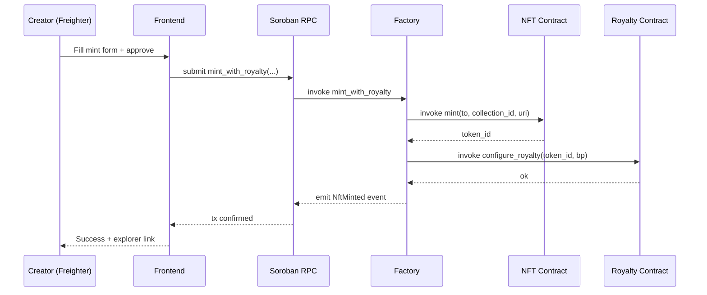

<p align="center">
  
</p>

<h1 align="center">BezaMint</h1>

<p align="center">
  <a href="https://github.com/BezaMint/BezaMint/actions/workflows/ci.yml">
    
  </a>
  <a href="https://github.com/BezaMint/BezaMint/blob/main/LICENSE">
    
  </a>
  <a href="#-deployed-contracts--stellar-testnet">
    
  </a>
  <a href="https://bezamint.vercel.app">
    
  </a>
  <a href="demo-video.mp4">
    
  </a>
  
  
  
  
  
  
  
</p>

<p align="center">
  <strong>An NFT creation and digital asset management platform</strong><br/>
  powered by <strong>Soroban smart contracts</strong> on the <strong>Stellar network</strong>.
</p>

<p align="center">
  <strong>🌐 <a href="https://bezamint.vercel.app">Live Demo</a></strong> ·
  <strong>⛓ <a href="#-deployed-contracts--stellar-testnet">Contracts live on Stellar Testnet</a></strong> ·
  <strong>🎬 <a href="demo-video.mp4">Demo Video</a></strong> ·
  <strong>📄 <a href="DEMO.md">Video Script</a></strong> ·
  <strong>🚀 <a href="docs/deployment-runbook.md">Deploy it</a></strong>
</p>

---

## 📑 Table of Contents

- [Why BezaMint?](#why-bezamint)
- [✨ Feature Highlights](#-feature-highlights)
- [🏗 Architecture](#-architecture)
- [🧠 Smart Contract Reference](#-smart-contract-reference)
- [📡 On-Chain Event Catalog](#-on-chain-event-catalog)
- [📚 Documentation](#-documentation)
- [🚀 Quick Start](#-quick-start)
- [📜 Deployed Contracts — Stellar Testnet](#-deployed-contracts-stellar-testnet)
- [🔗 On-Chain Transaction Verification](#-on-chain-transaction-verification)
- [🛡 Error Handling Matrix](#-error-handling-matrix)
- [🧪 Testing](#-testing)
- [📸 Screenshots](#-screenshots)
- [🎥 Demo Video](#-demo-video)
- [🌐 Deployment](#-deployment)
- [⚙️ CI/CD Pipeline](#-cicd-pipeline)
- [📦 Tech Stack](#-tech-stack)
- [📁 Environment Variables](#-environment-variables)
- [🗺 Roadmap](#-roadmap)
- [❓ FAQ](#-faq)
- [🧭 Glossary](#-glossary)
- [🤝 Contributing](#-contributing)
- [📄 License & Credits](#-license-credits)

---

## 📚 Documentation

| Document                                                           | Covers                                                                                 |
| ------------------------------------------------------------------ | -------------------------------------------------------------------------------------- |
| [`docs/architecture.md`](docs/architecture.md)                     | How the five contracts compose, the trust boundaries and the off-chain layer.          |
| [`docs/api-reference.md`](docs/api-reference.md)                   | Every `/api/*` route, its parameters, response shapes, error codes and rate limits.    |
| [`contracts/README.md`](contracts/README.md)                       | The authoritative contract interface reference and the deploy procedure.               |
| [`docs/indexer-schema.md`](docs/indexer-schema.md)                 | How emitted events map onto indexed records.                                           |
| [`docs/error-codes.md`](docs/error-codes.md)                       | Every contract error code, what raises it and what it means (generated).               |     | [`docs/deployment-runbook.md`](docs/deployment-runbook.md) | Deploying, verifying, upgrading, rolling back, and hosting the frontend. |
| [`deployments/testnet.json`](deployments/testnet.json)             | The published address registry: contract ids, wasm hashes, deployer and source commit. |
| [`docs/mainnet-readiness.md`](docs/mainnet-readiness.md)           | What must be true before mainnet, beyond what tests can prove.                         |
| [`docs/review/critical-review.md`](docs/review/critical-review.md) | An adversarial review of the repository and the findings it produced.                  |
| [`docs/faq.md`](docs/faq.md)                                       | Answers and troubleshooting: wallets, funding, upload limits, error codes.             |
| [`docs/glossary.md`](docs/glossary.md)                             | Stellar and Soroban vocabulary used across the code and docs.                          |
| [`ISSUES.md`](ISSUES.md)                                           | The current contributor backlog, verified against the tree.                            |

---

## Why BezaMint?

BezaMint is a complete, end-to-end dApp that brings NFT infrastructure to the Stellar ecosystem. Artists, brands, gaming studios, and digital creators can mint NFTs, manage collections, configure royalties, register creator profiles, and verify on-chain ownership — all through a polished, responsive interface backed by five custom Soroban smart contracts with inter-contract communication, on-chain event indexing, and layered error handling.

**Engineered for production. Built for the Stellar ecosystem.**

> **August 2026:** 100+ improvements across frontend, smart contracts, testing, CI/CD, accessibility, and developer experience.

---

## ✨ Feature Highlights

### 🎨 NFT Minting Engine

Full-featured minting workflow with metadata management, custom attributes (text, number, boost, date), IPFS pinning via Pinata, collection assignment, and granular royalty configuration — all backed by the deployed NFT smart contract.

### 📦 Collection Management

Create, edit, archive, and browse NFT collections with rich metadata, category tagging, and NFT-to-collection relationship tracking enforced on-chain through the Collection and Factory contracts.

### 💰 Royalty Configuration

Per-NFT or per-collection royalty settings with basis point precision (up to 10,000 bp = 100%), multi-recipient splits, and a freeze capability to lock terms permanently — recorded and quoted by the Royalty smart contract.

A bare NFT transfer carries no payment, so a contract cannot collect a royalty by itself. What the contract does provide is `quote_royalty`, which returns the exact per-recipient payout for a given sale price, with the rounding remainder assigned so the amounts sum precisely. Settlement is the caller's responsibility, and the marketplace integration that consumes it is on the roadmap rather than half-built here.

### 👤 Creator Profiles

On-chain creator registry with display names, bios, avatars, banner images, social links (8 platforms), verification badges, and portfolio statistics. The Creator contract stores immutable profile data on Stellar.

### 🔍 Ownership Verification

Real-time on-chain verification of NFT ownership against the Stellar blockchain. Enter a token ID, get the verified owner address, confirmation status, and network details instantly.

### 🔗 Inter-Contract Communication

The Factory contract orchestrates cross-contract calls — minting NFTs, configuring royalties, registering creators, and creating collections — all in single atomic transactions. Verified via on-chain `ContractsSet` event emission.

### ⚡ Event Polling and Indexing

Four contracts emit typed Soroban events. `useContractEvents` polls the Soroban RPC every 5 seconds in the browser, merging, deduplicating and sorting events by ledger; a server-side indexer keeps the same feed for the list APIs, so `/api/nfts`, `/api/collections` and `/api/creators` share one source of truth. Both match on the event's variant name rather than a positional index, so inserting a variant cannot silently break the feed.

### 🔐 Production Error Handling

Nine granular error categories handled end-to-end — from wallet-not-installed and connection-rejected through insufficient-balance, contract-execution-failure, network-failure, and user-cancelled transactions — with user-friendly toast notifications and clear recovery paths.

---

## 🏗 Architecture

```
bezamint/
├── apps/
│   └── web/                         # Next.js 15 frontend (App Router)
│       └── src/
│           ├── app/                 # Pages, layouts, API routes
│           ├── components/          # Reusable UI components
│           │   ├── layout/          # App shell (sidebar, header, mobile menu)
│           │   ├── mint/            # Minting form, TX status, royalty config
│           │   ├── collection/      # Collection cards, grid, creation form
│           │   ├── search/          # Search bar, filters, results
│           │   ├── profile/         # Creator profile, verification badge
│           │   ├── activity/        # Activity timeline
│           │   └── ui/              # Design system (cards, skeletons, stats)
│           ├── hooks/               # useTransaction, useContractEvents
│           ├── services/            # Stellar RPC, contract calls, IPFS
│           ├── context/             # Wallet provider, toast provider
│           └── lib/                 # Freighter detection, navigation, Pinata
├── packages/
│   └── shared/                      # TypeScript types, constants, validators
├── contracts/
│   ├── nft/                         # NFT: mint, transfer, burn, approve, balance
│   ├── collection/                  # Collection: CRUD, NFT membership, archive
│   ├── royalty/                     # Royalty: configure, update, freeze, query
│   ├── creator/                     # Creator: register, profile, social, verify
│   └── factory/                     # Factory: cross-contract orchestrator
├── scripts/
│   └── deploy.sh                    # One-command full deployment to Testnet
└── .github/
    └── workflows/                   # CI (lint, test, build), Release, Security
```

### Contract Orchestration



### Atomic Cross-Contract Mint



---

## 🧠 Smart Contract Reference

Five `#![no_std]` Soroban contracts, initialized through a Soroban `__constructor` so admin setup happens atomically inside contract creation rather than in a later, publicly callable transaction. Authorization is per-function, not uniform: `mint` is recipient-gated, transfers and burns are owner-gated, royalty configuration is admin-gated (the Factory, in production), verification is admin-gated, and every collection mutation is gated on the collection's creator.

**[`contracts/README.md`](contracts/README.md) is the authoritative interface reference** — the argument list, authorization requirement, storage model and pagination limits of every public function. The summaries below are a map of the surface area, not the contract itself.

### NFT — `BezaMintNft`

| Function                                           | Description                                                                           |
| -------------------------------------------------- | ------------------------------------------------------------------------------------- |
| `__constructor(admin)`                             | Bind the admin at deploy time (recipient of nothing; there is no public `initialize`) |
| `mint(to, collection_id, metadata_uri) -> u64`     | Mint a new NFT to `to`, who must authorize. Returns `token_id`                        |
| `transfer(from, to, token_id)`                     | Transfer ownership; `from` must be the current owner                                  |
| `transfer_from(spender, from, to, token_id)`       | Operator transfer with a per-token or blanket approval                                |
| `approve(operator, token_id)`                      | Grant a single-operator approval (cleared on transfer)                                |
| `set_approval_for_all(owner, operator, approved)`  | Grant/revoke blanket approval                                                         |
| `burn(token_id)`                                   | Burn an NFT; ids are never recycled                                                   |
| `total_supply() -> u64`                            | Highest minted id (burned tokens still count)                                         |
| `owner_of(token_id) -> Address`                    | Current owner                                                                         |
| `token_data(token_id) -> NftData`                  | On-chain record: creator, collection, metadata URI, mint timestamp                    |
| `balance_of(owner) -> u64`                         | NFT count from a dense per-owner index (one storage read)                             |
| `tokens_of_owner(owner, start, limit) -> Vec<u64>` | Paginated token ids for an owner, `limit` clamped to 100                              |
| `is_approved(operator, token_id) -> bool`          | Single-operator approval check                                                        |
| `is_approved_for_all(owner, operator) -> bool`     | Blanket approval check                                                                |

### Collection — `BezaMintCollection`

| Function                                                          | Description                                                                       |
| ----------------------------------------------------------------- | --------------------------------------------------------------------------------- |
| `__constructor(admin)`                                            | Set contract admin and collection counter (runs atomically at deploy)             |
| `create_collection(creator, metadata_uri) -> u64`                 | Create a collection, returns `id`                                                 |
| `update_collection(creator, id, new_metadata_uri)`                | Update collection metadata                                                        |
| `archive_collection(creator, id)`                                 | Archive a collection (soft-delete)                                                |
| `add_nft(collection_id, token_id)`                                | Attach an NFT; gated on the collection creator, refused if archived/full/assigned |
| `remove_nft(collection_id, token_id)`                             | Detach an NFT; gated on the collection creator, idempotent                        |
| `total_collections() -> u64`                                      | Total collections created                                                         |
| `get_collection(id) -> CollectionData`                            | Collection details                                                                |
| `get_nfts_in_collection(collection_id, start, limit) -> Vec<u64>` | Paginated member ids, `limit` clamped to 100                                      |
| `get_collection_for_nft(token_id) -> u64`                         | Reverse lookup: collection of an NFT (0 when unassigned)                          |
| `get_collections_by_creator(creator, start, limit) -> Vec<u64>`   | Paginated ids; archived collections are skipped                                   |

### Royalty — `BezaMintRoyalty`

| Function                                                                         | Description                                                             |
| -------------------------------------------------------------------------------- | ----------------------------------------------------------------------- |
| `__constructor(admin)`                                                           | Set contract admin (runs atomically at deploy)                          |
| `configure_royalty(creator, target_id, basis_points, recipients, is_collection)` | Admin-only; creates terms exactly once per target                       |
| `update_royalty(caller, target_id, basis_points, recipients, is_collection)`     | Creator or admin; refused once frozen                                   |
| `freeze_royalty(target_id, is_collection)`                                       | Lock terms permanently. Admin-only, irreversible                        |
| `remove_royalty(target_id, is_collection)`                                       | Delete terms; admin-only, refused if frozen                             |
| `set_admin(new_admin)`                                                           | Hand the admin role over (used during wiring)                           |
| `quote_royalty(target_id, is_collection, sale_price) -> Vec<RoyaltyPayout>`      | Exact per-recipient payout for a sale; amounts sum to the royalty total |
| `validate_basis_points(basis_points) -> bool`                                    | Ensure bp ≤ 10,000                                                      |
| `get_royalty(target_id, is_collection) -> RoyaltyConfig`                         | Read royalty configuration                                              |
| `is_frozen(target_id, is_collection) -> bool`                                    | Frozen status check                                                     |

### Creator — `BezaMintCreator`

| Function                                                             | Description                                                        |
| -------------------------------------------------------------------- | ------------------------------------------------------------------ |
| `__constructor(admin)`                                               | Set contract admin and creator counter (runs atomically at deploy) |
| `register(creator, display_name, bio, avatar_uri, banner_uri)`       | Register a creator profile                                         |
| `update_profile(creator, display_name, bio, avatar_uri, banner_uri)` | Update profile fields                                              |
| `set_social_links(creator, links)`                                   | Set social links (up to 8 platforms)                               |
| `verify_creator(creator)`                                            | Admin-gated verification badge                                     |
| `total_creators() -> u64`                                            | Total registered creators                                          |
| `get_profile(creator) -> CreatorProfile`                             | Full profile read                                                  |
| `is_registered(creator) -> bool`                                     | Registration check                                                 |
| `is_verified(creator) -> bool`                                       | Verification check                                                 |

### Factory — `BezaMintFactory`

| Function                                                                                                      | Description                                                                                                              |
| ------------------------------------------------------------------------------------------------------------- | ------------------------------------------------------------------------------------------------------------------------ |
| `__constructor(admin)`                                                                                        | Set contract admin (runs atomically at deploy)                                                                           |
| `set_contracts(nft, collection, royalty, creator)`                                                            | Admin-only. Links all four contracts, hands the Royalty admin role to the Factory, rejects zero/self/duplicate addresses |
| `mint_with_royalty(caller, to, collection_id, metadata_uri, basis_points) -> u64`                             | Atomic: mint NFT, link it to the collection **and** configure its royalty                                                |
| `burn_nft(caller, collection_id, token_id)`                                                                   | Atomic: burn the NFT **and** detach it, keeping `nft_count` honest                                                       |
| `create_collection_for_creator(caller, metadata_uri) -> u64`                                                  | Atomic: create collection **and** auto-register creator                                                                  |
| `get_nft_contract() / get_collection_contract() / get_royalty_contract() / get_creator_contract() -> Address` | Linked contract address queries                                                                                          |

---

## 📡 On-Chain Event Catalog

| Contract       | Event               | Payload                   | Meaning                                     |
| -------------- | ------------------- | ------------------------- | ------------------------------------------- |
| **Factory**    | `ContractsSet`      | 4× `Address`              | Factory linked to all four contracts        |
| **Factory**    | `NftMinted`         | `(u64, Address)`          | Atomic mint + royalty completed             |
| **Factory**    | `NftBurned`         | `(u64, Address)`          | Atomic burn + collection detach             |
| **Factory**    | `CollectionCreated` | `(u64, Address)`          | Collection + creator registration completed |
| **NFT**        | `Minted`            | `(u64, Address)`          | Token minted                                |
| **NFT**        | `Transferred`       | `(u64, Address, Address)` | Token moved                                 |
| **NFT**        | `Burned`            | `(u64, Address)`          | Token destroyed                             |
| **NFT**        | `Approved`          | `(u64, Address)`          | Operator approval granted                   |
| **Collection** | `Created`           | `(u64, Address)`          | New collection created                      |
| **Collection** | `Updated`           | `u64`                     | Collection metadata updated                 |
| **Collection** | `Archived`          | `u64`                     | Collection archived                         |
| **Collection** | `NftAdded`          | `(u64, u64)`              | NFT attached to collection                  |
| **Collection** | `NftRemoved`        | `(u64, u64)`              | NFT detached from collection                |
| **Royalty**    | `Configured`        | `(u64, u32)`              | Royalty terms set                           |
| **Royalty**    | `Updated`           | `(u64, u32)`              | Royalty terms changed                       |
| **Royalty**    | `Frozen`            | `u64`                     | Royalty terms locked forever                |
| **Royalty**    | `Removed`           | `u64`                     | Royalty terms deleted                       |
| **Royalty**    | `AdminChanged`      | `Address`                 | Royalty admin handed over                   |
| **Creator**    | `Registered`        | `Address`                 | Creator profile created                     |
| **Creator**    | `ProfileUpdated`    | `Address`                 | Profile edited                              |
| **Creator**    | `Verified`          | `Address`                 | Creator verified by admin                   |

> All five contracts emit events, including the NFT contract (`Minted`, `Transferred`, `Burned`, `Approved`). Ownership is also always readable directly via `total_supply`, `owner_of` and `token_data`, so a reader never has to replay the event log to learn current state. The server-side indexer consumes Factory and Creator events; [`docs/architecture.md`](docs/architecture.md) covers how they are encoded and decoded, and [`docs/indexer-schema.md`](docs/indexer-schema.md) covers the mapping.

---

## 🚀 Quick Start

### Prerequisites

- **Node.js** ≥ 20
- **pnpm** ≥ 9
- **Rust** & **cargo** (stable, with `wasm32-unknown-unknown` target)
- **Soroban CLI** ≥ 22.0
- **Freighter Wallet** browser extension

### Install & Run

```bash
git clone https://github.com/BezaMint/BezaMint.git
cd BezaMint
pnpm install
pnpm dev                  # Starts at http://localhost:3000
```

### Smart Contracts

```bash
# Build all five contracts
pnpm run contract:build

# Run the full contract test suite (198 tests across 5 crates)
pnpm run contract:test

# Deploy to Stellar Testnet
export BEZAMINT_DEPLOYER_SECRET="S..."
bash scripts/deploy.sh    # Builds, optimizes, deploys, generates .env.local
```

### Troubleshooting

- **`cargo: command not found`** — install the Rust toolchain with the `wasm32-unknown-unknown` target: `rustup target add wasm32-unknown-unknown`.
- **`ed25519-dalek`/`rand_core` version conflict in `cargo test`** — resolved. `soroban-env-host 22.1.3` declares `ed25519-dalek >= 2.0.0`, and an unconstrained resolution picked `3.0.0`, whose `rand_core 0.10` `CryptoRng` trait is incompatible with the `rand 0.8` `ChaCha20Rng` used by the SDK's testutils. The workspace now pins `ed25519-dalek = "2.2.0"` as a dev-dependency, unifying the graph on `rand_core 0.6`. If a fresh clone ever hits it again, run: `cd contracts && cargo update -p ed25519-dalek@3.0.0 --precise 2.2.0` (the `@3.0.0` disambiguates when both versions are present).

---

## 📜 Deployed Contracts — Stellar Testnet

| Contract       | Address                                                    |
| -------------- | ---------------------------------------------------------- |
| **NFT**        | `CDP2SWXDYGPNI4LKM7CSASSTWDXLHHS3USCNDUAFTJD3TZKFM6O4TOGQ` |
| **Collection** | `CCDDBJMP3E7AQFAO5RTQ6YJJEZQYSAD5QIOHJT75PYCO2A5FQKSNY4LH` |
| **Royalty**    | `CC4VHZG7LIMM2VE5JVFTROJTQVVGKIIGQ5MM6ZSYVODJPAMHLZ77FDXP` |
| **Creator**    | `CCCE3BFJKJQ6VZDHEYGRI7QA6Z4LAJQLRD4DHKZWURTINCPA2RWZQIBA` |
| **Factory**    | `CCDPJDAXU467HI7SJ7PJWXSMCWUFEGS47DD4PELTRJCCTM6FTBDTU2HJ` |

> **Deployer:** [`GDDTJU3O...`](https://stellar.expert/explorer/testnet/account/GDDTJU3ON5QFT7UZIERA4S4OITCDKZUPXS6GI7HC6OPCBDYVVP3UMRQF)
> **Deployed:** September 12, 2026
>
> Each contract takes its admin through a **constructor**, so deployment and
> initialization are a single transaction and there is no window in which an
> observer could claim the admin role in between. Check the wiring yourself:
>
> ```bash
> BEZAMINT_SOURCE_KEY=deployer bash scripts/verify-deploy.sh
> ```

This deployment is **seeded with real activity** — three collections and eighteen
tokens, minted through the Factory's atomic batch path — so the read APIs answer
with data rather than empty arrays. Reproduce it on any deployment with
`bash scripts/seed-testnet-activity.sh`.

### Interact from the Frontend

```typescript
import { mintNft, signAndSubmit, getTotalSupply, buildXlmPayment } from '@/services';

// Mint an NFT
const txXdr = await mintNft(source, destination, collectionId, 'ipfs://metadata/1');
const { txHash } = await signAndSubmit(
  txXdr,
  (status) => console.log(status), // signing → submitting → confirming
);

// Read total supply
const total = await getTotalSupply(source); // → number

// Send XLM
const { tx } = await buildXlmPayment(source, dest, '10.00', 'memo');
const { txHash } = await signAndSubmit(tx);
```

---

## 🔗 On-Chain Transaction Verification

Every transaction is verifiable on Stellar Explorer.

Six transactions produced the seeded activity below, and every one of them is
visible on the contracts named above.

| Activity                                  | Transaction                                                        | Explorer                                                                                                            |
| ----------------------------------------- | ------------------------------------------------------------------ | ------------------------------------------------------------------------------------------------------------------- |
| Create collection — **Stellar Drift**     | `80fd81907a39d861b82cc191d0297f44e076899f52a70cf717ed380709f618fd` | [View](https://stellar.expert/explorer/testnet/tx/80fd81907a39d861b82cc191d0297f44e076899f52a70cf717ed380709f618fd) |
| **Batch mint 6 tokens** — Stellar Drift   | `944606e8297ab3472265be8848de6cec1ec05cd8a20d0d4301f1df7a7eab6fd7` | [View](https://stellar.expert/explorer/testnet/tx/944606e8297ab3472265be8848de6cec1ec05cd8a20d0d4301f1df7a7eab6fd7) |
| Create collection — **Soroban Signals**   | `91404525e8c77c520985d20c404258c07643444734bb4017efd8a970d0189dcf` | [View](https://stellar.expert/explorer/testnet/tx/91404525e8c77c520985d20c404258c07643444734bb4017efd8a970d0189dcf) |
| **Batch mint 6 tokens** — Soroban Signals | `2656b2b02a4016393ba1376b5119ce717a2a2d71f274a126fc046f658c118c41` | [View](https://stellar.expert/explorer/testnet/tx/2656b2b02a4016393ba1376b5119ce717a2a2d71f274a126fc046f658c118c41) |
| Create collection — **Testnet Terrain**   | `ca15a19b87f69c72738856a857842cc454609a2599104357afce2c8ac42d5bcb` | [View](https://stellar.expert/explorer/testnet/tx/ca15a19b87f69c72738856a857842cc454609a2599104357afce2c8ac42d5bcb) |
| **Batch mint 6 tokens** — Testnet Terrain | `4a7522d15bfba2472b3de1aa3106840021f22913c9342ef7171c8d7c4a128c6e` | [View](https://stellar.expert/explorer/testnet/tx/4a7522d15bfba2472b3de1aa3106840021f22913c9342ef7171c8d7c4a128c6e) |

Two details worth checking on those links. Each **batch mint is one transaction
for six tokens**, not six — that is the Factory's atomic `mint_batch_with_royalty`
path, and a failure on any token in the batch reverts all of them. And each mint
transaction carries a `factory` event alongside the `nft`, `col` and `royalty`
events it triggers, which is the cross-contract call the Factory is there to make.

> The record of what was seeded — collection ids, token ids and these hashes — is
> written to [`demo/seed-manifest.json`](demo/seed-manifest.json) by the seed
> script, so a claim about on-chain activity can be checked against a specific
> transaction rather than taken on faith.

---

## 🛡 Error Handling Matrix

BezaMint implements defense-in-depth across the entire stack:

| Error Category             | Frontend Handling                                      | Contract Handling                  |
| -------------------------- | ------------------------------------------------------ | ---------------------------------- |
| Wallet not installed       | `isFreighterInstalled()` check with clear CTA          | N/A (client-side)                  |
| Connection rejected        | "Wallet access was denied" toast                       | N/A (client-side)                  |
| Wallet disconnected        | `onAccountChanged` listener, auto-cleanup              | N/A (client-side)                  |
| Insufficient balance       | `checkBalance()` pre-flight before every TX            | N/A (client-side)                  |
| Invalid transaction        | Try/catch with descriptive message                     | Soroban revert with error message  |
| Contract execution failure | `waitForTransaction` FAILED status → user-friendly msg | `panic!` with descriptive strings  |
| Network failure            | Catch on all RPC/Horizon calls, graceful degradation   | N/A (network layer)                |
| User cancelled transaction | "Transaction was cancelled by user" notification       | N/A (client-side)                  |
| Invalid user input         | Form-level validation with field-level error messages  | `assert!` guards on all public fns |

---

## 🧪 Testing

| Suite           | Framework      | Tests   | Status             |
| --------------- | -------------- | ------- | ------------------ |
| Smart Contracts | Rust `#[test]` | 198     | ✅ 198/198 passing |
| Frontend        | Vitest         | 412     | ✅ 412/412 passing |
| **Total**       |                | **608** | **All passing**    |

```bash
pnpm test                # Frontend: 412/412 passing (63 files)
pnpm run contract:test   # Contracts: 198 tests across 5 crates
```

Counts are the totals those two commands report on this tree; nothing generates
them, so a suite that grows has to update them.

| Contract crate        | Tests |
| --------------------- | ----- |
| `bezamint-nft`        | 57    |
| `bezamint-collection` | 38    |
| `bezamint-royalty`    | 46    |
| `bezamint-creator`    | 28    |
| `bezamint-factory`    | 27    |

Beyond the unit suites, CI enforces the things tests cannot state on their own:
`cargo fmt` and `clippy -D warnings`, a rustdoc warning gate, per-contract wasm
size budgets, a coverage floor, a client bundle budget, and a **contract ABI
drift check** that fails when a rebuilt interface differs from the committed
snapshot.

There is also an end-to-end smoke test that runs against a live deployment —
`SMOKE_BASE_URL=... bash scripts/smoke-test.sh` — because the unit tests mock the
RPC, and everything that can only go wrong against a real chain is therefore
invisible to them. The runbook explains what it covers and why.

---

## 📸 Screenshots

Captured from the app running against the testnet deployment listed above.

| Feature                        | Desktop                                                         | Mobile                                                         |
| ------------------------------ | --------------------------------------------------------------- | -------------------------------------------------------------- |
| **Landing Page**               |             |             |
| **Dashboard**                  |         |         |
| **Collections**                |     |     |
| **Mint NFT Form**              |                   |                   |
| **Explore & Search**           |             |             |
| **Ownership Verification**     |               |               |
| **Settings & Contracts**       |           |           |
| **Creator Profile**            |             |             |
| **Wallet Options**             |       |       |
| **Wallet Connected + Balance** |  |  |
| **Mint Form Filled**           |         | –                                                              |
| **CI/CD Pipeline**             |                      | –                                                              |

> **21 screenshots** — 11 unique views spanning all pages, wallet states, CI, and test evidence.

---

## 🎥 Demo Video

A 2-minute walkthrough covering all major features — landing, dashboard, collections, smart contract settings, NFT minting, search & discovery, ownership verification, and creator profiles.

> **▶️ Watch:** [`demo-video.mp4`](demo-video.mp4) · **📄 Script:** [`DEMO.md`](DEMO.md)

---

## ✅ Production Readiness Checklist

- [x] Smart contract tests (198/198 passing)
- [x] Frontend tests (412/412 passing)
- [x] End-to-end smoke test against a live deployment
- [x] Security headers (HSTS, X-Frame-Options, X-Content-Type-Options, Referrer-Policy)
- [x] CI/CD pipeline (4 workflows)
- [x] Error boundaries and graceful fallbacks
- [x] Accessibility (skip links, ARIA labels, keyboard nav)
- [x] TypeScript strict mode
- [x] Environment variable documentation
- [x] Contributing guidelines
- [x] Issue and PR templates
- [ ] Mainnet deployment
- [ ] Load testing

---

## 🌐 Deployment

| Environment   | Status                                                                      |
| ------------- | --------------------------------------------------------------------------- |
| **Contracts** | 5/5 live on Stellar Testnet, wired, verified and seeded                     |
| **Frontend**  | https://bezamint.vercel.app — auto-deployed from `main` on every push       |
| **CI/CD**     | 4 GitHub Actions workflows (CI, Deployment Verification, Release, Security) |

The frontend deployment is automatic: the Vercel GitHub App watches `main` and
builds a production deployment on every push, with pull requests getting their own
preview URL. No workflow in this repository has to trigger it, which is exactly why
the verification above exists — nothing else would notice a deploy that half-succeeded.

The deployed addresses, the wasm hash of each contract and the commit the wasm was
built from are published in [`deployments/testnet.json`](deployments/testnet.json)
— the registry `docs/mainnet-readiness.md` requires — so a reader can check the
frontend against the chain rather than trust this table. `pnpm run deploy:record:check`
fails CI when the registry, the table above and `demo/seed-manifest.json` drift apart,
which is the failure a redeployment causes when one of the three is missed.

`NEXT_PUBLIC_*` values are inlined at build time and come from the **host's**
project settings, not from this repository, so a hosted instance does not move when
the contracts are redeployed — it keeps reading whichever set it was built with.
That is worth checking on any deployment, including the hosted one:

```bash
# Which commit the alias serves, and whether all five contracts answer.
curl -s https://bezamint.vercel.app/api/health | jq '{commitSha, contracts: .checks.contracts}'
```

The hosted instance is checked the same way and reads the set in
[`deployments/testnet.json`](deployments/testnet.json): all five contracts answer,
`/api/nfts` lists the seeded tokens across three collections, and
the indexer holds their events. That state is not free — it had to be configured,
and the paragraph above is the reason it is worth re-checking rather than assumed:

```bash
SMOKE_BASE_URL=https://bezamint.vercel.app bash scripts/smoke-test.sh   # all 30 checks
```

IPFS is configured on the hosted instance too, so the pinning path is a working
feature there rather than a fallback: `POST /api/ipfs/upload` returns a real CID,
the CID's own digest proves it identifies the uploaded bytes, and the metadata
proxy reads that document back. Two properties of public gateways are worth
knowing before reading that check's output, because both look like faults and are
not:

- **The health probe can report `status: 429`.** Every public gateway measured
  (`ipfs.io`, `dweb.link`, `w3s.link`, `nftstorage.link`) rate-limits datacenter
  egress, so the probe treats _a response_ as reachability and a throttle as a
  note. Gating readiness on a third party's rate limiter flapped a healthy deploy.
- **Server-side reads step over a refusing gateway.** `getIpfsGateways()` always
  ends with the pinning provider's gateway — the one host that answers from a
  datacenter — so the metadata proxy falls back rather than returning `502`.

Reads a visitor makes happen in their browser, against `NEXT_PUBLIC_PINATA_GATEWAY`,
which is why that default is the fast gateway and not the reliable one. The
measurements behind both choices are in `apps/web/src/lib/ipfsGateway.ts`.

Add `SMOKE_IPFS_UPLOAD=1` to pin a real document and assert a CID comes back; it is
opt-in because a passing run spends pinning quota.

A caveat that is easy to hit from the other direction: `NEXT_PUBLIC_APP_URL` must
name a **publicly reachable** host. Vercel's team-scoped `*-<team>.vercel.app`
domain and its per-deployment URLs can sit behind Vercel Authentication, so naming
one there points the Open Graph tags and the sitemap at a page a crawler cannot
fetch — the site works, the previews do not. Both mistakes were present here and
both are fixed; the procedure, and what to prune while you are in the project, is
[`docs/deployment-runbook.md` §3](docs/deployment-runbook.md#31-a-hosted-deployment-keeps-its-own-copy-of-these-values).
`Deployment Verification` reports the gap automatically after every production
deploy.

```bash
pnpm install
cp .env.example apps/web/.env.local   # contract ids, RPC URL, network
pnpm dev                              # http://localhost:3000
```

The frontend is not tied to a hosted instance: it reads whatever contracts its
environment names, so pointing `apps/web/.env.local` at the testnet deployment
above — the values in [`deployments/testnet.json`](deployments/testnet.json) — is
enough to see the seeded collections and tokens. `docs/deployment-runbook.md`
walks through a fresh deploy, verifying it, seeding it and hosting the frontend.

---

## ⚙️ CI/CD Pipeline

| Workflow                    | Trigger                   | Jobs                                                                                |
| --------------------------- | ------------------------- | ----------------------------------------------------------------------------------- |
| **CI**                      | Push to `main`, PRs       | Contract Tests · Lint & Format · Frontend Tests · Frontend Build                    |
| **Deployment Verification** | A production deploy lands | Assert the alias serves the deployed commit, then smoke test the live app over HTTP |
| **Release**                 | Git tags (`v*.*.*`)       | Build contracts → Upload wasm artifacts → GitHub Release                            |
| **Security**                | Weekly + dep changes      | `pnpm audit --audit-level=high` and `rustsec/audit-check` on the contracts          |

`CI` proves the code is good; it does not prove the thing that went live is
serving it. Vercel deploys `main` through its GitHub App, so a push reaches
production without this repository's CI being involved — `Deployment Verification`
is what closes that loop. On every successful production deployment it waits for
the alias to answer, asserts that `/api/health` reports the very commit that was
deployed (Vercel supplies it as `VERCEL_GIT_COMMIT_SHA`), and then runs
[`scripts/smoke-test.sh`](scripts/smoke-test.sh) against the live app. It can also
be run by hand from the Actions tab against any URL.

---

## 📦 Tech Stack

| Layer               | Technology                                                 |
| ------------------- | ---------------------------------------------------------- |
| **Frontend**        | Next.js 15, React 19, TypeScript 5.7, Tailwind CSS 4       |
| **Smart Contracts** | Soroban SDK 22.0.11 (Rust), `#![no_std]`                   |
| **Blockchain**      | Stellar Testnet (Mainnet-ready configuration)              |
| **Wallet**          | Freighter Browser Extension, `@stellar/freighter-api` v4   |
| **SDK**             | `@stellar/stellar-sdk` v13 (Soroban RPC + Horizon)         |
| **Events**          | Soroban contract events, `useContractEvents` polling hook  |
| **Storage**         | IPFS via Pinata SDK                                        |
| **State**           | React Context + Zustand                                    |
| **Build**           | Turborepo, pnpm 9                                          |
| **Testing**         | Rust `#[test]`, Vitest                                     |
| **CI/CD**           | GitHub Actions; any Node host (see the deployment runbook) |
| **Notifications**   | react-hot-toast                                            |

---

## 📁 Environment Variables

```bash
# apps/web/.env.local
NEXT_PUBLIC_STELLAR_NETWORK=testnet
NEXT_PUBLIC_STELLAR_RPC_URL=https://soroban-testnet.stellar.org
NEXT_PUBLIC_STELLAR_PASSPHRASE=Test SDF Network ; September 2015
NEXT_PUBLIC_NFT_CONTRACT_ID=CDP2SWXDYGPNI4LKM7CSASSTWDXLHHS3USCNDUAFTJD3TZKFM6O4TOGQ
NEXT_PUBLIC_COLLECTION_CONTRACT_ID=CCDDBJMP3E7AQFAO5RTQ6YJJEZQYSAD5QIOHJT75PYCO2A5FQKSNY4LH
NEXT_PUBLIC_ROYALTY_CONTRACT_ID=CC4VHZG7LIMM2VE5JVFTROJTQVVGKIIGQ5MM6ZSYVODJPAMHLZ77FDXP
NEXT_PUBLIC_CREATOR_CONTRACT_ID=CCCE3BFJKJQ6VZDHEYGRI7QA6Z4LAJQLRD4DHKZWURTINCPA2RWZQIBA
NEXT_PUBLIC_FACTORY_CONTRACT_ID=CCDPJDAXU467HI7SJ7PJWXSMCWUFEGS47DD4PELTRJCCTM6FTBDTU2HJ
NEXT_PUBLIC_EXPLORER_URL=https://stellar.expert/explorer/testnet
```

> `scripts/deploy.sh` generates this file automatically after a fresh deployment — you never need to edit contract IDs by hand.

---

## 🗺 Roadmap

- **Stellar Mainnet deployment** — migrate from Testnet with deployer-key rotation
- **NFT Marketplace** — on-chain listing, offers, and secondary-sale royalty enforcement
- **Multi-chain wallets** — Albedo, WalletConnect, and Lobstr support
- **Collection analytics** — minting volume, holder distribution, and floor-price tracking
- **Verified collection badges** — brand-level verification beyond creator-level

---

## ❓ FAQ

BezaMint runs on **Stellar Testnet** (`soroban-testnet.stellar.org`) and uses the
[Freighter](https://freighter.app) wallet. Royalties are configured in basis
points with multi-recipient splits and can be frozen on-chain, and metadata is
pinned to IPFS via Pinata while ownership lives on chain.

The full FAQ — wallet and network problems, funding a testnet account, upload
limits, decoded contract error messages and API troubleshooting — is in
[`docs/faq.md`](docs/faq.md).

---

## 🧭 Glossary

New to Stellar, Soroban, stroops, TTLs, archiving or basis points? The
[glossary](docs/glossary.md) defines the vocabulary used across the contracts, the
server code and these docs.

---

## 🤝 Contributing

Contributions are welcome! BezaMint uses conventional commits (`.commitlintrc.json`) with Husky hooks.

**CI gates** — every PR must pass:

- `pnpm format:check` — Prettier formatting
- `pnpm lint` — ESLint
- `pnpm test` — Vitest (412 tests)
- `pnpm --filter @bezamint/web run test:coverage` — coverage, with a ratcheted floor
- `cd contracts && cargo test` — Rust (198 tests), plus clippy, rustfmt and the rustdoc gate
- `cd contracts && cargo build --release --target wasm32-unknown-unknown` — wasm size budgets and the contract ABI snapshot
- `pnpm build` — production build, plus the client bundle budget

**Workflow**

1. Fork the repo and create a feature branch
2. Make your changes with tests
3. Open a Pull Request against `main` — CI runs automatically

---

## 📄 License & Credits

MIT — see [LICENSE](LICENSE).

Built with ❤️ for the Stellar ecosystem.

- **Stellar Development Foundation** — Soroban smart contract platform
- **Freighter** — Stellar browser wallet
- **Next.js & Vercel** — Frontend framework & deployment
- **Tailwind CSS** — Styling
- **Turborepo** — Monorepo orchestration
